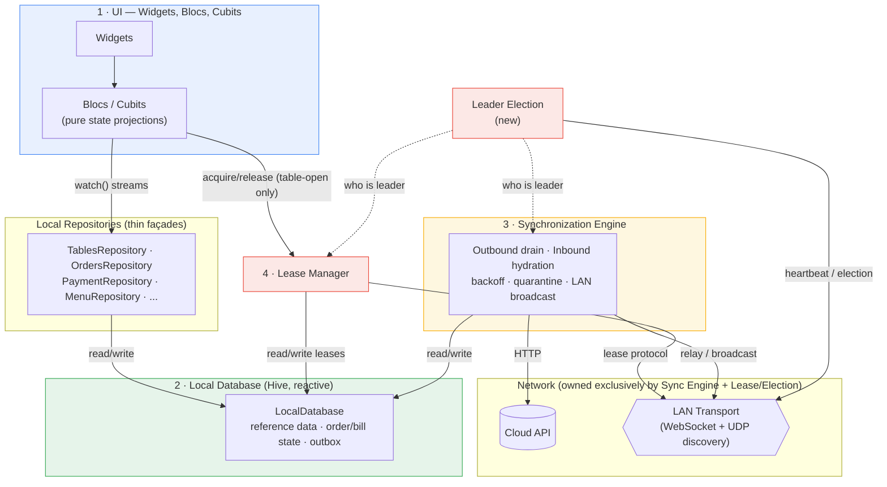
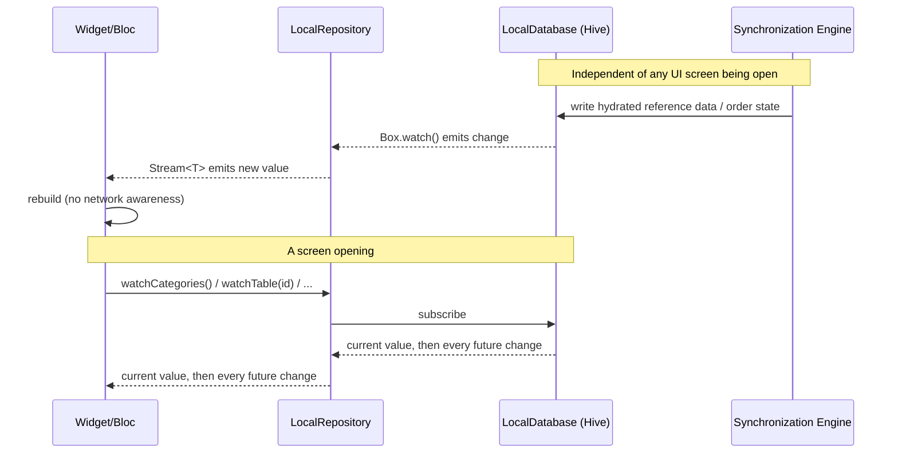
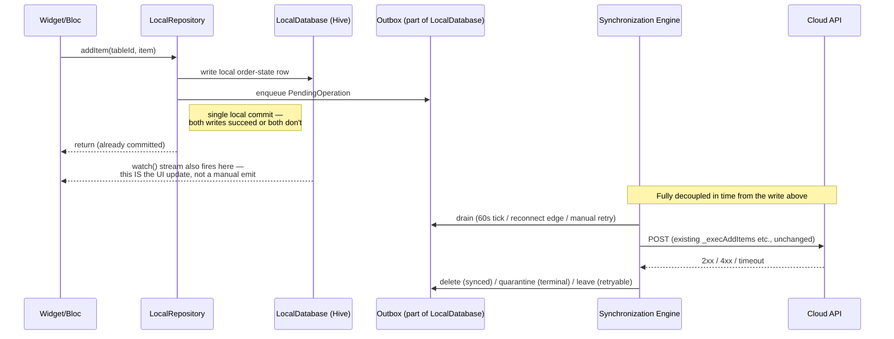
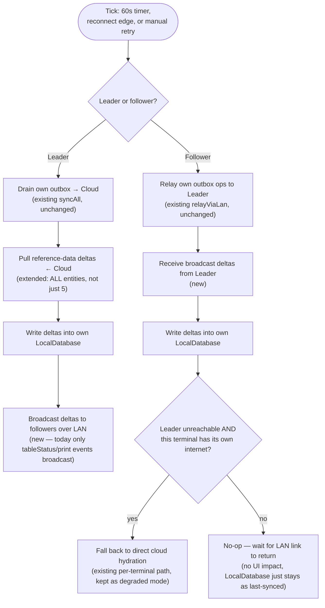
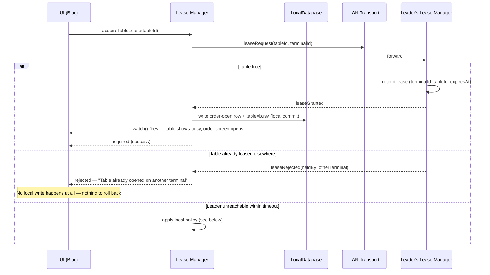
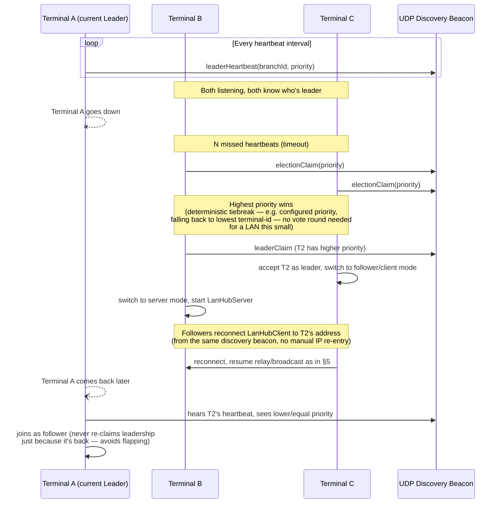
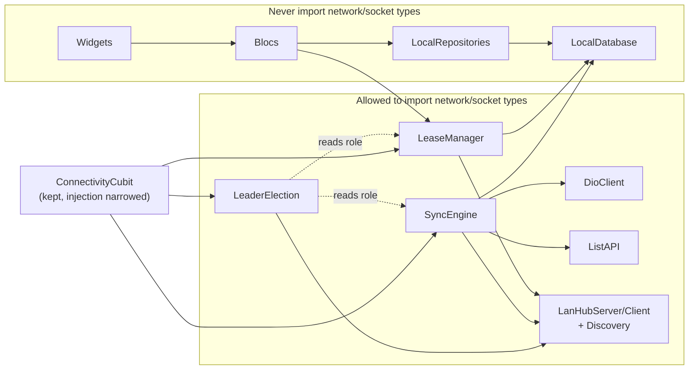

Hey, do you know what our, what... So I have an application, Mary app, and it's a Flutter application, and I'm trying to make it offline first. So, do you know what offline first means here? When you're logging in, everything will be fetched, and during the application, during the use of application, nothing gets loaded. You will make no request that blocks order creation, showing menus, closing orders, paying orders, what else? So, things like that. Everything will be offline first. So, here's what I'm trying to do. And Cloud Code is fucking it up. For some reason, it cannot understand what offline first means. I explicitly told that application will be divided into two, and they will be connected via database. So, here's the thing. Local database, of course. And the first side is client-facing side. It never loads because it has local database and it has instant access to it. So there's that. And there's a second part, which is the backend part of the application. And it syncs with the backend server and updates the local database with new data. So that way, it will never rely on the internet. So, that way, the first side of the application never relies on the internet. That's what I'm trying to do. And by telling you it never relies on the internet, I mean, it never does. Nothing whatsoever gets blocked by internet connection or sending requests or whatever that is. Database gets updated, and the client-facing side will be updated based on that. I mean, it can use signals to update something when there is something new from the backend side of the application. But other than that, that's it. But for some fucking reason, the categories page is being loaded for some reason because it has instant access. What the fuck? Preload it... No, don't preload it. It should work seamlessly because it should never load. And it should sync every minute. So, the backend side should sync with the backend server, our main global backend server, in every 60 seconds. It will fetch the new data, and if there is something new, it pushes it to the global backend server. That was the plan, and for some fucking reason, Cloud Code doesn't understand it and fucking it up. So I need you to be the judge of that. I want you to create this prompt that checks that what I'm trying to do here. Is it aligned, this application is aligned with what I'm trying to do here. I will use that prompt. Please use curse words in that. Be brutal

Here's a prompt that should make the expectations extremely clear. It is intentionally aggressive, since you explicitly asked for that.

Offline-First Architecture Audit (Read This Before You Touch Anything)

You're not here to write code first. You're here to judge whether this implementation follows the architecture. If it doesn't, call it out. Be brutal. Don't be nice. Don't assume intent. Judge the implementation.

The Rule

This application is 100% offline-first.

If you ever see the client/UI waiting for the network to do anything, that's a bug.

I don't care if it's only one request.
I don't care if it's only for categories.
I don't care if it's "just a refresh."
I don't care if it's cached.

If the UI depends on the network, you fucked up.

The Architecture

The application is split into two completely separate logical parts.

1. Client/UI Layer

This is the part the cashier interacts with.

Its ONLY data source is the local database.

Not REST.

Not GraphQL.

Not WebSocket.

Not internet.

Not "fetch if cache is empty."

Not "load on first open."

Not "refresh."

Not "try network then local."

ONLY. THE. LOCAL. DATABASE.

If a screen needs categories...

Read them from local DB.

If it needs menus...

Read them from local DB.

If it needs tables...

Read them from local DB.

If it needs orders...

Read them from local DB.

Everything.

The UI must be able to run for hours with the internet unplugged.

2. Sync Engine

This is the ONLY part allowed to communicate with the backend.

Its responsibilities are:

pull new data from the server
push local changes
resolve conflicts
update the local database
retry failed requests
work in the background

The UI NEVER talks to the backend directly.

Ever.

Communication

The UI and Sync Engine communicate ONLY through the local database.

The Sync Engine updates the DB.

The UI reacts to DB changes.

That's it.

No exceptions.

Sync Cycle

Every 60 seconds:

fetch updates
upload pending operations
apply changes
update local DB

If the internet is gone...

Queue everything.

Continue working.

Retry later.

The cashier should barely notice.

Absolutely Forbidden

If you introduce ANY of these, you're violating the architecture:

❌ FutureBuilder calling APIs

❌ Repository deciding whether to fetch remotely

❌ "Load Categories"

❌ "Refresh Menus"

❌ "Fetch when opening screen"

❌ Network requests inside Widgets

❌ Network requests inside Controllers

❌ Network requests inside ViewModels

❌ "If local empty, fetch server"

❌ Waiting for HTTP before rendering

❌ Showing loading because internet is slow

❌ Blocking order creation because request hasn't finished

❌ Blocking payment because request hasn't finished

❌ Blocking table changes because request hasn't finished

❌ Any screen whose first source of truth is the backend

If any of this exists, call it out.

What SHOULD happen

Cashier opens Categories.

Categories appear instantly.

No spinner.

No loading.

No request.

No internet.

No delay.

Because they already exist locally.

One minute later...

The Sync Engine downloads a new category.

Writes it into the local DB.

The UI automatically updates because it observes the database.

The UI never asked for anything.

It simply reacted to local data changing.

Your Job

Review every feature against this architecture.

For every violation, explain:

What is wrong
Why it violates offline-first
Which layer is responsible
How it should work instead

Do NOT suggest adding another API call.

Do NOT suggest preloading data before opening a screen.

Do NOT suggest fetching on demand.

Those are architectural failures.

The fix is always to make the Sync Engine synchronize data into the local database and make the UI read only from the local database.

Final Question

After reviewing the implementation, answer only one question first:

"Is this implementation actually offline-first?"

If the answer is anything except an unqualified YES, explain exactly where the architecture has been violated.

Be ruthless. If you see even one place where the UI waits for the network or directly depends on it, call it out immediately. Don't sugarcoat it. Don't defend it. Don't invent excuses. Just say: "This breaks the offline-first architecture."

This prompt makes the architecture explicit and gives the model a clear pass/fail criterion instead of leaving room for interpretation. It also distinguishes the UI process from the sync process, which is the key idea Claude seems to be missing.


All right, we are trying to make it offline first. And the prompt you gave me is perfect, all right? And as I said, as far as it is offline first, that one application should connect to another when they are on the same network. All right? So, this is also set. And I wanna make sure that this is also meets expectations. So, how are we gonna do this here? So, like I said, it should offline first, that no network request should block the UI interface, client-facing side of the application. But in some cases, if the network, there is update from the other application instance, not from the backend, but from the other application instance, it should get updated, right? But it should never load again, it should never load. It's just that there should be a sync up between two application instances on the same network. So, yeah, give me another prompt that checks for that. And I want you to be as brutal as possible for this one too.

This is actually a second architectural rule, and it's worth stating separately.

Your first prompt enforces **offline-first**.

This second prompt enforces **peer-to-peer synchronization**.

The important rule is that **LAN synchronization is not allowed to become another "backend".** It's just another source of changes that eventually end up in the local database. The UI should still know nothing about it.

# Local Network Synchronization Audit (Don't Turn LAN Into Another Backend)

You're reviewing this implementation for one thing only:

**Does LAN synchronization preserve the offline-first architecture?**

If not, call it out immediately.

Don't be polite.

Don't invent excuses.

If the architecture is violated, say it.

---

## The Rule

There are multiple application instances running on the same local network.

They may synchronize with each other.

**The UI must never know this is happening.**

The UI has exactly one source of truth:

**The local database.**

Nothing else.

Not HTTP.

Not WebSockets.

Not sockets.

Not peer discovery.

Not another application.

Not "the master device."

The UI does not care.

---

## Architecture

There are now three logical components.

### 1. UI Layer

Reads ONLY from the local database.

Never communicates with:

* backend server
* another application
* local socket
* websocket
* TCP
* UDP
* HTTP

Nothing.

Its only dependency is the local database.

---

### 2. Sync Engine

Responsible for synchronizing with the global backend.

Every 60 seconds:

* upload pending operations
* download updates
* merge changes
* write everything into the local database

Nothing else touches the backend.

---

### 3. LAN Sync Engine

Responsible for discovering nearby application instances and exchanging changes.

Its responsibilities:

* discover peers
* send local changes
* receive remote changes
* resolve conflicts
* write changes into the local database

That's it.

It is NOT another backend.

It is NOT another repository.

It is NOT another data source for the UI.

It ONLY updates the local database.

---

## Data Flow

The ONLY legal flow is:

Backend

↓

Sync Engine

↓

Local Database

↓

UI

AND

Nearby Application

↓

LAN Sync Engine

↓

Local Database

↓

UI

Every path must end at the local database before reaching the UI.

If the UI bypasses the database even once...

**The architecture is broken.**

---

## Absolutely Forbidden

If you introduce ANY of these, you've fucked up.

❌ UI asking another application for data

❌ Widget opening a socket

❌ Repository reading from another device

❌ Controller making LAN requests

❌ "Request latest order from peer"

❌ "Fetch tables from nearby device"

❌ "Refresh categories from another application"

❌ Waiting for LAN response

❌ Spinner while another application responds

❌ Blocking because another device is offline

❌ "Try peer first"

❌ "Peer cache"

❌ Any direct UI → Peer communication

❌ Any UI code that knows peers even exist

If any of this exists, the architecture has failed.

---

## Correct Behavior

Cashier opens Orders.

Orders appear instantly.

No network.

No sockets.

No LAN discovery.

No waiting.

Because they're already in the local database.

Meanwhile...

Another cashier creates an order.

The LAN Sync Engine receives it.

Writes it into the local database.

The UI automatically updates because it observes the database.

The UI never requested anything.

The UI doesn't even know another application exists.

---

## Network Failure

If the LAN disappears...

Nothing should break.

The cashier keeps working.

Orders continue.

Payments continue.

Tables continue.

Everything continues.

Synchronization resumes automatically when peers become available again.

If losing LAN breaks the UI...

You fucked up.

---

## Your Job

Inspect every feature.

Whenever you find communication that bypasses the local database, call it out immediately.

For every violation explain:

* What component is responsible
* Why it violates the architecture
* What the correct data flow should be

Do NOT recommend:

* fetching directly from peers
* asking another application for data
* waiting for peer responses
* refreshing UI from the network

The only acceptable fix is:

**Peer → LAN Sync Engine → Local Database → UI**

Nothing else.

---

## Final Question

Answer this before anything else:

**"Does this implementation preserve offline-first while synchronizing with nearby application instances?"**

If the answer is anything except an unqualified **YES**, explain exactly which architectural rule has been violated.

Be ruthless. If you see the UI depending on a nearby application even once, say it plainly:

**"This breaks the offline-first architecture by treating another application instance as a live data source instead of treating the local database as the only source of truth."**

I would add **one more non-negotiable rule** to both prompts because it's the heart of this architecture:

> **The UI never consumes network data directly. Every piece of data—whether it comes from the internet, another application on the LAN, Bluetooth, WebSockets, or any future transport—must first be persisted to the local database. The local database is the single source of truth. Every network is merely a producer of database updates, never a producer of UI state.**

That one sentence captures the philosophy of your architecture and makes it much harder for an AI (or a developer) to accidentally introduce a network dependency into the client-facing side.


And here is the same. There will be one main application instance. And every other application instance will be connected to that, all right? And one more thing. Every instance have its own local database. But for that main application instance, its local database will be global. That's it. We won't have two databases for one application, it's just once one of theirs will be global, that's all. Also add that to your prompt and give me the full rewrite of it.


Your architecture is actually even more specific than "offline-first." It's a **hub-and-spoke** architecture.

* Every application instance has **exactly one** local database.
* One application is elected/configured as the **Main Instance**.
* The Main Instance's local database is the **global source of truth** for the LAN.
* Satellite instances synchronize **with the Main Instance**, not with each other.
* The UI still **only** reads from its own local database.

That distinction is important because otherwise an AI may decide to implement peer-to-peer synchronization between every device.

Here's the rewritten prompt.

# LAN Synchronization Architecture Audit (Don't Fuck This Up)

You're reviewing this implementation for architectural correctness.

Not coding style.

Not performance.

Not naming.

Architecture.

If the implementation violates this architecture even once, call it out immediately.

Don't be nice.

Don't defend bad decisions.

Don't assume "it probably works."

Judge the implementation exactly as described.

---

# The Most Important Rule

This application is **offline-first.**

The cashier must be able to continue working regardless of:

* internet failure
* backend failure
* slow network
* temporary synchronization issues

Nothing on the client-facing side may wait for any network request.

Ever.

If the UI waits for a network request...

**You fucked up.**

---

# One Database Per Application

Every application instance owns **exactly one database.**

Not two.

Not a cache plus a database.

Not a temporary store plus a database.

Exactly one.

That database is the application's single source of truth.

Everything the UI displays comes from that database.

Everything.

---

# Main Application Instance

Exactly one application instance acts as the Main Instance.

The Main Instance is special for one reason only:

**Its local database is considered the global database for the local network.**

This does NOT mean it has two databases.

It still has only one local database.

That database simply becomes the authoritative LAN database.

Do not create:

* global database + local database
* cache database + master database
* replicated UI database

No.

One application.

One database.

The Main Instance's local database is the global source of truth for the LAN.

---

# Satellite Application Instances

Every other application is a Satellite Instance.

Satellite instances also have exactly one local database.

Their UI reads only from that database.

Satellite instances synchronize with the Main Instance.

They DO NOT synchronize directly with each other.

Never introduce peer-to-peer synchronization between satellite devices.

The only synchronization path is:

Satellite ↔ Main Instance

Nothing else.

---

# UI Layer

The UI knows nothing about networking.

It never talks to:

* backend server
* Main Instance
* satellite instances
* sockets
* TCP
* UDP
* HTTP
* WebSockets

Nothing.

The UI only talks to the local database.

If the UI knows another application exists...

**The architecture is already broken.**

---

# Internet Synchronization

Only the Main Instance communicates with the global backend server.

Every 60 seconds it:

* uploads pending changes
* downloads updates
* resolves conflicts
* writes everything into its own local database

Satellite instances never communicate with the global backend directly unless explicitly designed to do so.

The backend is invisible to the UI.

---

# LAN Synchronization

Satellite instances synchronize only with the Main Instance.

The synchronization engine is responsible for:

* sending local changes
* receiving global changes
* resolving conflicts
* updating the local database

The UI is NOT responsible.

Repositories are NOT responsible.

Widgets are NOT responsible.

Controllers are NOT responsible.

Everything must flow through the synchronization engine.

---

# Data Flow

The only legal architecture is:

Global Backend

↓

Main Sync Engine

↓

Main Instance Local Database (Global LAN Database)

↓

LAN Synchronization

↓

Satellite Local Database

↓

Satellite UI

Likewise, local changes flow in reverse:

Satellite UI

↓

Satellite Local Database

↓

LAN Synchronization

↓

Main Instance Local Database

↓

Backend Sync Engine

↓

Global Backend

Every network path ends by writing into a local database before the UI observes it.

If network data reaches the UI directly...

You broke the architecture.

---

# Absolutely Forbidden

If you introduce ANY of these...

You've fucked up.

❌ UI requesting data from another application

❌ UI requesting data from the backend

❌ Widget opening sockets

❌ Repository deciding whether to fetch remotely

❌ "Refresh Orders"

❌ "Load Categories"

❌ "Fetch Tables"

❌ "Sync Before Opening Screen"

❌ "If local empty, fetch from Main"

❌ Waiting for Main Instance

❌ Waiting for LAN

❌ Waiting for Backend

❌ Spinner because synchronization is happening

❌ FutureBuilder calling APIs

❌ Repository returning network responses directly

❌ Controller talking to sockets

❌ Satellite communicating directly with another satellite

❌ Any network request blocking order creation

❌ Any network request blocking payment

❌ Any network request blocking table operations

❌ Any network request blocking menu browsing

❌ Any UI code whose first source of truth is not the local database

If any of these exist...

The implementation is architecturally wrong.

---

# Correct Behavior

Cashier opens Categories.

Categories appear instantly.

No loading.

No spinner.

No request.

No waiting.

Because they already exist in the local database.

Another terminal creates an order.

The Main Instance receives it.

The Main Instance updates its local database.

LAN synchronization distributes the change.

Each Satellite updates its own local database.

The UI automatically refreshes because it observes the local database.

The UI never requested anything.

The UI never knew synchronization happened.

---

# Failure Scenarios

If the internet disappears...

The Main Instance keeps operating locally.

Satellite instances keep operating locally.

Synchronization resumes later.

If the Main Instance temporarily disconnects...

Satellite instances continue using their own local databases.

No screen should suddenly become unusable.

No screen should start requesting data.

No screen should show endless loading.

Everything continues using local data until synchronization resumes.

---

# Your Job

Inspect every layer.

Whenever you find a violation:

Explain:

* exactly what is wrong
* which architectural rule it violates
* which component is responsible
* what the correct architecture should be

Do NOT recommend:

* loading data directly
* requesting data from peers
* fetching on demand
* waiting for synchronization
* bypassing the local database

Every fix must preserve one principle:

**The local database is the only source of truth for the UI. Every network—whether the global backend or the Main Instance—is merely a producer of database updates, never a producer of UI state.**

---

# Final Question

Before reviewing anything else, answer this:

**"Does this implementation preserve the offline-first architecture while using the Main Instance as the authoritative LAN synchronization hub?"**

If the answer is anything except an unqualified **YES**, explain every architectural violation.

Be ruthless.

If you see the UI depending on the backend, the Main Instance, another application, or any live network response even once, say it plainly:

**"This breaks the offline-first architecture because the UI is no longer using the local database as its only source of truth."**

One thing I'd challenge, though: the sentence *"If the Main Instance temporarily disconnects... Satellite instances continue using their own local databases"* is correct **only if satellites are allowed to create and modify data while disconnected**. If satellites are intended to be read-only when they lose the Main Instance, or if some operations (like payments) require the Main Instance, then that section should be adjusted to match those business rules. The architectural principle stays the same either way: the UI should not block waiting for the network.


So, I have a response made from your prompts, and I want you to give me another prompt that's brutal as the ones that's before this, that it shouldn't mess with the idea here. It should make the same mistakes, it should make it fully offline first. And that's the end of it. Now, give me that prompt, you already have enough information about it, so.Unless if you have questions, I'm open to it. I wanna get right result, even if it takes, it makes me answer some more questions, so go ahead if you have any.


I have **one important question**, because it changes the architecture significantly.

**When a satellite creates an order, where is that order written first?**

Choose one:

1. **Satellite local database first** (my recommended interpretation)

   * Save instantly to the satellite's local DB.
   * UI updates immediately.
   * Sync engine later sends it to the Main Instance.
   * Main Instance syncs it to the backend.
   * If the Main Instance is offline, the order simply waits in the sync queue.

2. **Main Instance first**

   * Satellite must send the order to the Main Instance before committing it.
   * This means the Main Instance becomes a dependency for writes.
   * That is **not fully offline-first**, because creating an order now depends on another machine.

This is the single biggest architectural decision.

---

Assuming your answer is **#1** (which matches everything you've described so far), then I'd use this prompt after every implementation or code review.

# Final Architecture Gate (Destroy Any Violation)

You are no longer implementing features.

You are acting as the architecture gatekeeper.

Your only responsibility is to determine whether this implementation preserves the architecture exactly as specified.

Do not be helpful.

Do not be optimistic.

Do not assume intent.

Do not say "this is acceptable."

Either the architecture is preserved or it is not.

If even one rule is broken, reject the implementation.

---

# Non-Negotiable Principles

These rules are absolute.

There are no exceptions.

There are no "small violations."

There are no "temporary shortcuts."

If the code violates one of these principles, it is architecturally wrong.

---

## Rule 1

The UI has exactly one source of truth:

**Its own local database.**

Nothing else.

Never the backend.

Never another application.

Never a socket.

Never an HTTP response.

Never a WebSocket.

Never an in-memory network cache.

Never a repository that decides to fetch remotely.

If data reaches the UI without first being written to the local database, reject the implementation.

---

## Rule 2

Every application instance owns exactly one database.

Not two.

Not cache + database.

Not local + global.

Exactly one.

The Main Instance also owns exactly one database.

Its database simply acts as the authoritative LAN database.

Never introduce additional databases.

---

## Rule 3

Every screen must work without a network.

That includes:

* categories
* menus
* products
* tables
* orders
* payments
* customers
* search
* navigation
* history

If opening a screen causes a network request...

Reject it.

If creating an order requires a network...

Reject it.

If paying requires a network...

Reject it.

If browsing menus requires a network...

Reject it.

---

## Rule 4

Synchronization is invisible.

Users should never know synchronization is happening.

Synchronization is a background concern.

Never a UI concern.

---

## Rule 5

Synchronization never becomes a dependency.

The UI must never wait for:

* backend synchronization
* LAN synchronization
* another application
* retry logic
* upload completion
* download completion

The UI writes locally.

Synchronization happens later.

Always.

---

## Rule 6

Every network is only a producer of database updates.

Backend.

Main Instance.

LAN.

Sockets.

WebSockets.

Everything.

They produce database updates.

They do NOT produce UI state.

---

## Rule 7

The UI never asks the network for anything.

Ever.

No exceptions.

No fallback.

No "if missing."

No "refresh."

No "load."

No "fetch."

No "request latest."

No "peer lookup."

Everything already exists locally.

---

# Forbidden Patterns

Immediately reject the implementation if you find:

❌ FutureBuilder performing network calls

❌ Repository fetching remote data for UI

❌ Widgets making requests

❌ Controllers making requests

❌ ViewModels making requests

❌ Service classes returning network responses directly to the UI

❌ Loading indicators caused by networking

❌ Pull-to-refresh fetching remote data

❌ Screen initialization triggering API calls

❌ Lazy-loading business data

❌ "Fetch when opening"

❌ "Load if empty"

❌ "Refresh from server"

❌ "Request from Main Instance"

❌ Direct socket communication from presentation code

❌ Any bypass around the local database

---

# Your Review

Inspect every layer.

Challenge every assumption.

Look for hidden dependencies.

Assume the implementation is wrong until proven otherwise.

Whenever you see code that touches networking, immediately ask:

**"Does this update the local database first, or is it feeding the UI directly?"**

If it feeds the UI directly...

Reject it.

---

# Your Output

Start with one of two answers.

ONLY ONE.

## PASS

"The implementation preserves the offline-first architecture."

or

## FAIL

"The implementation violates the offline-first architecture."

If it fails, list every violation.

Do not suggest compromises.

Do not say "good enough."

Do not say "acceptable."

Do not say "works for now."

Architectural correctness is binary.

Either it follows the architecture completely...

Or it doesn't.

I think this is the strongest possible "gatekeeper" prompt. It doesn't tell the model **how** to implement the system—it forces it to **prove** that every piece of code respects the architecture before considering it acceptable. That tends to work much better than implementation-focused prompts because it changes the model's role from "builder" to "strict reviewer."


**Satellite local database first** (my recommended interpretation)

 

-  Save instantly to the satellite's local DB. 
-  UI updates immediately. 
-  Sync engine later sends it to the Main Instance. 
-  Main Instance syncs it to the backend. 
-  If the Main Instance is offline, the second one becomes the main one 


That last sentence changes the design in an important way.

What you're describing is **automatic leader election (failover)**.

Instead of having one permanently designated Main Instance, you have:

* Every instance has **exactly one local database.**
* Every instance can operate completely independently.
* Normally, one instance is the **Leader (Main Instance)**.
* All other instances synchronize with the Leader.
* If the Leader disappears, another instance is automatically elected as the new Leader.
* When the old Leader comes back, it becomes a follower again (or another leader election occurs, depending on your algorithm).
* The UI **must never know** that a leader change happened.

That is a much stronger architecture than simply "one main app."

I would add another non-negotiable rule to your architecture:

> **Leadership is an implementation detail. The UI must never know which instance is currently the Leader. Changing Leaders must never change how the UI behaves.**

I'd also add another rule:

> **Synchronization, leader election, service discovery, networking, conflict resolution, retries, and failover all belong to the synchronization layer. None of them belong in the presentation layer, repositories used by the UI, controllers, or widgets.**

One question I'd ask before locking down the architecture:

**When two satellite instances both create orders while the Leader is offline, and a new Leader is elected, what determines the correct order of events?**

For example:

```
Terminal A creates Order #101

Leader dies

Terminal B becomes Leader

Terminal C creates Order #102

Old Leader comes back

Everything synchronizes
```

How do you decide which order IDs, timestamps, or conflicts win?

If you haven't designed that part yet, **don't use auto-increment IDs** for orders. Generate globally unique IDs (such as UUIDv7 or ULID) on each terminal when the order is created. That way, every terminal can create records independently without ID collisions during failover, and synchronization becomes much simpler. This is a standard approach in offline-first distributed systems.


timestamps 


Using **timestamps alone is not enough** if you have multiple devices.

Here's why.

Imagine this:

```
Terminal A time: 10:00:01
Terminal B time: 09:59:58
```

Both create an order "at the same time."

When they sync, which one came first?

You don't actually know, because device clocks are never perfectly synchronized. One machine could be a few seconds (or minutes) ahead.

Instead, I'd recommend this:

* **Every record gets a globally unique ID** (UUIDv7 or ULID are excellent choices).
* **Every record has `created_at` and `updated_at` timestamps.**
* **The Leader orders events using timestamps** (assuming clocks are reasonably synchronized via NTP).
* If two events have exactly the same timestamp, use the unique ID as a deterministic tie-breaker.

For example:

```
Order:
  id: 0198d...
  created_at: 2026-08-07T16:30:15.123Z
  updated_at: 2026-08-07T16:30:15.123Z
```

This avoids collisions and gives you a deterministic ordering.

One more suggestion: **keep the Leader as simple as possible.** It shouldn't be "special" because it owns different data. It should only be special because it currently performs coordination (LAN synchronization and backend synchronization). Every instance should have the same schema and capabilities. If the Leader dies, another instance simply takes over those responsibilities without needing a different database or different application logic.

That makes failover much easier and keeps your offline-first architecture clean.


No, here's the thing. That's why the sync is a problem, right? So I was thinking that we should have a real-time update. Yeah, real-time update. So, I want to display, man, let's just say I ordered the, I opened a new order for table one from the second machine, and the first machine should sync in real time with that. Like, as soon as, as soon as I click the order create, or save the order, right, the order is officially open. There is an open order for that table one. And all the other instances should display that, that, that table has already old, has already an order. And during that time, it should sync up, you know? I mean, that would real-time means for me.And for the syncing with the global server, one will be syncing in all scenarios. So, yeah, the main one syncs with the global server. And if the main one fails or shuts down, the second one that's connected should take over. I know it's hard to do here because there are race conditions, but I think there's some, there should be something. I mean, we can use locks. Like, let's just say the ZKP space that the, you, of course, here is the main machine here, since it has the main server, right? So, fuck, it becomes hard, doesn't it? What would you suggest in this case? I'm a bit lost here.


I think you've reached the point where **offline-first** becomes **distributed systems**, and that's where the complexity comes from.

The good news is that your requirements are reasonable. The tricky part is deciding **where authority lives**.

## What you want

From what you've described, I think your requirements are:

* Every terminal has its own local database.
* Every UI reads **only** from its own local database.
* Creating an order is instant.
* No network request ever blocks the cashier.
* Changes propagate to every terminal almost immediately (within milliseconds if the LAN is healthy).
* One terminal synchronizes with the cloud backend.
* If that terminal dies, another one takes over.

Those goals are all compatible.

---

## The mistake I think you're about to make

You said:

> We can use locks.

I'd avoid distributed locks unless you absolutely need them.

Distributed locks are notoriously difficult to get right, especially when machines crash or the network partitions. They introduce problems like deadlocks, lock expiration, and split-brain scenarios.

---

## I'd separate two concepts

### 1. Local commit (instant)

When a cashier presses "Create Order":

```
Save order to local DB

↓

UI updates immediately

↓

Return success
```

Done.

No waiting.

No LAN.

No backend.

The cashier is finished.

---

### 2. Replication (background)

Immediately after the local commit:

```
Send change to Leader

↓

Leader validates it

↓

Leader broadcasts it

↓

Other terminals update local DB
```

If the LAN is healthy, this happens in a few milliseconds, so it *feels* real-time.

---

## The biggest problem

This one:

```
Terminal A

opens Table 1

at exactly the same time

Terminal B

opens Table 1
```

Now you have two valid local commits.

Both UIs already show success.

Which one wins?

That's the hard problem.

---

## I would NOT solve this with locks

I'd solve it with **ownership**.

Imagine this flow:

```
Terminal B

Create Order(Table 1)

↓

Save locally

↓

Broadcast:
"I opened Table 1"

↓

Leader receives

↓

Leader checks

Is Table 1 already open?

YES → reject

NO → accept
```

If rejected:

```
Terminal B

updates local DB

marks order cancelled

shows

"Table already opened on another terminal."
```

The cashier sees the conflict after the fact.

That's actually how many distributed systems work: they accept local writes first, then resolve conflicts.

---

## Or...

If you absolutely must guarantee that only one terminal can open a table, then someone must be authoritative.

That authority could be:

* Leader terminal
* Cloud backend
* Dedicated local server

But then opening a table requires contacting that authority.

That violates your original rule:

> Nothing should block on the network.

So you have to choose which requirement is more important.

---

## My recommendation

I'd make **opening a table** the only operation that requires consensus if double-booking is unacceptable.

Everything else stays offline-first.

For example:

* ✅ Browse menus → local
* ✅ Add items → local
* ✅ Edit quantities → local
* ✅ Notes → local
* ✅ Kitchen status → local
* ✅ Payment calculations → local

But:

* ⚠️ "Claim Table 7" is a coordination problem.

It's okay if that one operation has special handling, because it's fundamentally about ensuring only one terminal claims the same resource.

---

## Leader election

For failover, I'd avoid inventing your own algorithm.

Use an established leader election approach (for example, based on a consensus algorithm) or use a lightweight coordination service if your deployment allows it.

Rolling your own leader election with timeouts and heartbeats often works in demos but tends to fail in edge cases like network partitions or simultaneous recoveries.

---

### My biggest question

**Can two cashiers legitimately try to open the same table at the exact same moment?**

If the answer is **yes**, then no architecture can guarantee both:

1. zero network dependency, **and**
2. zero possibility of duplicate table claims.

Those two goals are fundamentally in tension. You either accept that conflicts can happen and resolve them after synchronization, or you require coordination before claiming the table.

That's the key product decision you need to make before choosing the implementation.


I understand the last problem here, other than that, the solution for everything else, right? Well, that's the problem. We are saving it to the local DB first to make it fast. I understand that, and I don't want to give up on that idea. That is to make our application seamless. But on the other hand, when there are two instances created, it will be a real pain in the ass, right? Actually, I don't know. Damn, I don't know. What would be the best idea here? I mean, I'm going to... I have to do something, right? So, to make it work real-time and solving that race conditions, what would be the best idea here?


I think you're asking exactly the right question. The important realization is this:

> **This isn't a programming problem anymore. It's a consistency problem.**

Every offline-first POS system eventually has to answer the same question.

## Option 1: Fully offline-first (my recommendation)

```
Cashier presses "Open Table"

↓

Save locally immediately

↓

UI updates immediately

↓

Broadcast to Leader

↓

Leader approves/rejects

↓

Everyone syncs
```

Pros:

* Instant UI.
* Works without network.
* Best user experience.

Cons:

* Very rarely, two terminals may open the same table at nearly the same time.
* You need conflict resolution.

This is called **optimistic concurrency**. Many distributed systems use it.

---

## Option 2: Ask the Leader first

```
Open Table

↓

Ask Leader

↓

Leader says OK

↓

Save locally
```

Pros:

* No duplicate tables.

Cons:

* If the Leader is down...
* If Wi-Fi is slow...
* If LAN is congested...

The cashier waits.

This breaks your biggest goal.

---

## Option 3: Reserve the table (my favorite compromise)

This is what I'd seriously consider.

Opening a table is special.

Everything else stays offline-first.

```
Open Table

↓

Broadcast reservation request

↓

Leader responds in ~20 ms

↓

Table reserved

↓

Everything else is local
```

Adding food?

Local.

Changing quantity?

Local.

Payment?

Local.

Kitchen?

Local.

Closing order?

Local.

Only claiming ownership of a table requires coordination.

Since claiming a table usually happens once per customer, a 20–50 ms delay is almost invisible.

---

## Option 4: Accept conflicts

This is the simplest architecture.

If two terminals open Table 5:

Leader decides.

Terminal A wins.

Terminal B receives:

```
Table already opened by Terminal A.
```

Its local order becomes cancelled or marked as conflicted.

Cashier creates a new order.

This sounds bad, but if it happens once every few months, it may be perfectly acceptable.

---

# What I'd build

Honestly?

I'd build this:

```
UI

↓

Local DB

↓

Sync Queue

↓

LAN Sync

↓

Leader

↓

Cloud
```

The UI never waits.

The sync queue immediately pushes changes over the LAN.

With a healthy network, other terminals see updates in 10–100 ms, so it feels real-time.

---

## Then solve the one hard problem separately

Don't treat "opening a table" like every other operation.

Treat it as **claiming ownership of a shared resource**.

That's fundamentally different from adding fries to an order.

---

# If this were my POS

I'd probably do this:

* ✅ Menus → local
* ✅ Categories → local
* ✅ Orders → local
* ✅ Add item → local
* ✅ Remove item → local
* ✅ Notes → local
* ✅ Payments → local
* ✅ Kitchen status → local
* ✅ Reports → local
* ✅ Customers → local

Special case:

```
Open Table

↓

Try locally

↓

Immediately broadcast

↓

If conflict exists

↓

Leader decides

↓

Loser terminal rolls back

↓

Cashier gets

"Table was opened on another terminal."
```

The chance of two people opening the same table in the same second is usually **very low** in a restaurant.

So instead of slowing down **every single operation** to prevent a rare edge case, I'd optimize the common case and handle the rare conflict cleanly.

---

## One final thought

Ask yourself this product question:

> **How much money would the restaurant lose if two cashiers accidentally opened the same table once every 100,000 operations?**

If the answer is "almost nothing," then the simplest and fastest architecture is usually the right one.

If the answer is "that's absolutely unacceptable," then you need a coordination step for table claiming—and that means accepting a small amount of network dependency for that specific operation.

That's the tradeoff every distributed POS system has to make. There isn't a design that guarantees **instant local writes**, **no network dependency**, and **perfect global exclusivity** simultaneously in the face of network delays or failures. One of those goals has to bend slightly.


Option 3is great. I willing to go for that, now giving that brutal prompt of yours, include how application should work, how it should sync, everything, all right? And I'll create a big-ass plan with Cloud Agent that execute it. That's a good idea.


I actually think **Option 3 is the sweet spot**. It preserves what matters most:

* The application is still **offline-first** for almost everything.
* The UI never becomes "network-driven."
* You only coordinate **ownership of shared resources** (tables), which is exactly where distributed systems need coordination.
* Everything else remains local and asynchronous.

I would make one small adjustment, though:

> **Don't think of it as "asking permission." Think of it as "acquiring a lease."**

The Leader doesn't own the UI. It only arbitrates ownership of tables. Everything else stays offline-first.

---

# MASTER ARCHITECTURE SPECIFICATION

# READ THIS BEFORE WRITING A SINGLE LINE OF CODE

You are not implementing features.

You are implementing an architecture.

Your job is to preserve this architecture exactly.

If you cannot preserve it, STOP and explain why.

Do NOT silently compromise.

Do NOT introduce "temporary solutions."

Do NOT "just fetch from the server."

Do NOT "load it when opening the screen."

If you violate this architecture even once, you have failed.

---

# Philosophy

This POS is designed to feel instantaneous.

The cashier should never think about networking.

Networking is background infrastructure.

The application must always feel local.

Every screen.

Every interaction.

Every button.

Every animation.

Everything.

---

# The Golden Rule

The UI NEVER depends on the network.

Not the internet.

Not the Leader.

Not another terminal.

Not a socket.

Not an HTTP request.

Not a WebSocket.

Nothing.

The UI depends ONLY on the local database.

That rule is absolute.

---

# Architecture

Every application instance contains exactly four logical components.

## Component 1 — UI

The UI displays information.

The UI never fetches information.

It only observes the local database.

If data changes...

The UI updates automatically.

The UI never asks where the data came from.

---

## Component 2 — Local Database

Every application owns exactly ONE database.

Never two.

Never cache + database.

Never temporary storage.

Exactly one.

This database is the application's single source of truth.

Everything shown on screen comes from this database.

Everything.

---

## Component 3 — Synchronization Engine

Responsible for:

* syncing with Leader
* syncing with Cloud (Leader only)
* retries
* conflict resolution
* background uploads
* background downloads

It is the ONLY networking component.

Nothing else communicates over the network.

---

## Component 4 — Lease Manager

This component exists for ONE reason only.

Coordinating ownership of shared resources.

Example:

Tables.

Only tables.

Not menus.

Not categories.

Not products.

Not reports.

Only shared resources that cannot safely exist twice.

---

# Leader

Exactly one terminal is the Leader.

The Leader synchronizes with the Cloud.

The Leader coordinates leases.

The Leader distributes updates.

The Leader does NOT become another backend for the UI.

The UI still reads only from its own database.

---

# Leader Failover

If the Leader disappears...

Another terminal becomes Leader.

Automatically.

No manual intervention.

No UI changes.

No special screen.

No restart.

Leadership is an implementation detail.

The cashier must never know who the Leader is.

---

# Synchronization

Synchronization is continuous.

It is NOT tied to screens.

It is NOT tied to pages.

It is NOT tied to repositories.

It is NOT tied to widgets.

Synchronization runs independently.

Whenever something changes...

Broadcast it immediately.

Do NOT wait one minute.

Do NOT wait for the user.

Do NOT wait until opening another screen.

Synchronize immediately.

If synchronization fails...

Queue it.

Retry later.

Never block the UI.

---

# Cloud Synchronization

Only the Leader communicates with the Cloud.

Leader:

Upload pending changes.

Download new changes.

Apply changes.

Update Leader database.

Broadcast changes.

Followers never communicate with the Cloud.

---

# LAN Synchronization

Followers synchronize with the Leader.

Leader broadcasts updates immediately.

Followers apply updates immediately.

All synchronization writes into the local database.

The UI reacts only to database changes.

Never directly to network messages.

---

# Table Ownership

Opening a table is different.

Opening a table is NOT just creating data.

Opening a table claims ownership of a shared resource.

Therefore it uses a Lease.

Workflow:

Cashier presses "Open Table."

↓

Lease Manager requests lease from Leader.

↓

Leader checks whether table is already leased.

↓

If free:

Leader grants lease.

↓

Follower creates order locally.

↓

UI updates instantly.

↓

Synchronization broadcasts the order.

If occupied:

Leader rejects lease.

↓

UI immediately informs cashier.

"Table is already opened on another terminal."

No duplicate ownership.

No guessing.

No race condition.

This is the ONLY operation requiring coordination.

Everything else remains offline-first.

---

# Everything Else

Everything else is local-first.

Adding items.

Removing items.

Changing quantity.

Changing notes.

Kitchen updates.

Payments.

Discounts.

Printing.

Searching.

Browsing.

Filtering.

Categories.

Menus.

Customers.

Reports.

History.

Everything.

Write locally first.

Synchronize afterward.

Never wait for networking.

---

# Forbidden

Immediately reject any implementation containing:

❌ FutureBuilder performing API calls

❌ Repository fetching for UI

❌ Screen loading data from network

❌ Widget making HTTP request

❌ Widget opening sockets

❌ Controller talking to Leader

❌ ViewModel requesting backend

❌ Refresh button fetching data

❌ Loading categories from server

❌ Loading menus from server

❌ Waiting for synchronization

❌ Waiting for uploads

❌ Waiting for downloads

❌ Waiting for another terminal

❌ "Fetch if local empty"

❌ "Try server first"

❌ "Load on first open"

❌ Any bypass around the local database

❌ More than one database per application

❌ Followers communicating directly with the Cloud

❌ UI depending on Leader responses except during lease acquisition

If any of these exist...

Stop.

Reject the implementation.

Explain exactly why.

---

# Required Properties

The application must satisfy ALL of these.

✅ UI always reads from local database.

✅ Networking is completely isolated.

✅ Synchronization is automatic.

✅ Synchronization is invisible.

✅ Synchronization never blocks UI.

✅ Every instance owns exactly one database.

✅ Leader owns exactly one database.

✅ Followers own exactly one database.

✅ Leader synchronizes with Cloud.

✅ Followers synchronize with Leader.

✅ Updates propagate through LAN almost immediately.

✅ Leader failover is automatic.

✅ UI never knows Leader changed.

✅ Table ownership is coordinated.

✅ Everything else remains local-first.

---

# Review Instructions

Do not review code style.

Do not review naming.

Do not review formatting.

Only review architecture.

Whenever networking appears, ask:

"Does this network operation eventually update the local database, or is it feeding the UI directly?"

If it feeds the UI directly...

Reject it.

Whenever a screen appears, ask:

"Can this screen fully function with the internet disconnected?"

If the answer is no...

Reject it.

Whenever a feature appears, ask:

"Does this feature still work if synchronization is delayed?"

If not...

Reject it.

---

# Final Question

Before reviewing anything else, answer this:

**Does this implementation preserve the architecture exactly as specified?**

The answer is binary.

YES.

Or

NO.

There is no "mostly."

There is no "good enough."

There is no "close."

Either the architecture is preserved...

Or it is broken.

If it is broken, identify every violation and explain precisely why it violates this specification.

One last recommendation: before letting Claude implement this, have it produce a **design document first**. That document should define the synchronization protocol, leader election, lease acquisition, message formats, failure handling, and conflict resolution. Only after you approve that design should it start writing code. In projects like this, a solid design document can prevent weeks of rework.


Do you suggest to tags those two responses that I got from your prompts, first two prompts? I miss the short prompt, or I can just give the short prompt away, instead so it will use less tokens.

I actually **wouldn't** feed Claude all three prompts every time. That's a lot of tokens, and much of it overlaps.

Here's the approach I'd use.

### 1. Make the architecture spec the source of truth ✅

The **MASTER ARCHITECTURE SPECIFICATION** (the last big prompt) should become your canonical document.

Treat it like an `ARCHITECTURE.md` or `OFFLINE_FIRST.md`.

It defines the rules.

---

### 2. Keep a short review prompt ✅

Then have a very short prompt that you reuse whenever Claude makes changes.

Something like:

> Review every change against `OFFLINE_FIRST.md`.
>
> Reject any implementation that violates the architecture.
>
> Pay special attention to:
>
> * UI depending on networking
> * direct API calls from presentation code
> * bypassing the local database
> * synchronization blocking the UI
> * incorrect Leader/Follower responsibilities
> * incorrect lease acquisition for table ownership
>
> If you find a violation, stop immediately, explain why it violates the architecture, and propose an implementation that preserves every architectural rule.

That's only ~80 tokens instead of 2,000.

---

### 3. Store the architecture in the repository ⭐

This is the biggest improvement.

Create something like:

```text
docs/
    OFFLINE_FIRST_ARCHITECTURE.md
```

or

```text
CLAUDE.md
```

Then every session simply says:

> Read `docs/OFFLINE_FIRST_ARCHITECTURE.md` before making any changes. It is the highest-priority architectural specification. If your implementation violates it, stop and explain why.

Now Claude doesn't need the giant prompt every time.

---

## What I'd do

```
docs/
    OFFLINE_FIRST_ARCHITECTURE.md   <-- the big document
    SYNC_PROTOCOL.md                <-- later
    LEADER_ELECTION.md              <-- later
```

Then every task starts with:

```
Read OFFLINE_FIRST_ARCHITECTURE.md.

Review your plan against it before writing code.

If your implementation violates the architecture, stop immediately and explain why instead of writing code.
```

That's all.

---

I have **one suggestion** that I think will save you a lot of pain later.

Don't put the synchronization protocol, lease protocol, leader election, and offline-first philosophy into one huge document. Split them:

* **OFFLINE_FIRST_ARCHITECTURE.md** → The principles (UI only reads local DB, sync never blocks UI, one DB per instance, etc.).
* **SYNC_PROTOCOL.md** → How changes are replicated, queued, acknowledged, retried, and conflict resolution.
* **LEADER_AND_LEASES.md** → Leader election, failover, lease acquisition for tables, heartbeat, timeouts.

That separation makes the documents much easier to maintain and gives Claude a much clearer mental model of the system.


## Final Question: Does this implementation preserve the architecture exactly as specified?

**NO.**

I checked the current uncommitted diff (`offline-again` branch, 5,237 insertions across 63 files) against every violation in the open [offline-first-violations-audit.md](vscode-webview://0m2kb10bf4h7n03ibcjnmj2ce5f1086fh6n15h95l5r4bp7an7lk/offline-first-violations-audit.md), because the diff touches exactly the files the audit flags. Despite the size of the change, **all nine violations are still present, unchanged in shape.** The diff added real infrastructure (cache entries for users/service-charge/transaction-groups/ingredients/compounds, `isConnectivityIssue` centralized on `Failure`, quarantine handling, print queue, token storage rewrite) — but it did not touch the one thing the spec calls the Golden Rule: the UI still awaits live network calls before completing state transitions.

### Confirmed still-present, verbatim shape

| #File\:lineStatus |                                                                                                                                                                                                                                                                                                                                                                           |                                                                                                                                                                                                                                                                                                                                                                                                                                                                                                                      |
| ----------------- | ------------------------------------------------------------------------------------------------------------------------------------------------------------------------------------------------------------------------------------------------------------------------------------------------------------------------------------------------------------------------- | -------------------------------------------------------------------------------------------------------------------------------------------------------------------------------------------------------------------------------------------------------------------------------------------------------------------------------------------------------------------------------------------------------------------------------------------------------------------------------------------------------------------- |
| V1                | [create\_order\_bloc.dart:104-243](vscode-webview://0m2kb10bf4h7n03ibcjnmj2ce5f1086fh6n15h95l5r4bp7an7lk/lib/features/view/main/presentation/cubit/create_order/create_order_bloc.dart#L104-L243)                                                                                                                                                                         | Unchanged. `if (!_connectivity.isOnline)` → offline path; else `await _createOrderUsecase.call(request)` / `_mainRepository.createOrderItems(...)`, falls into the queue only via `catch`/`ConnectionFailure`.                                                                                                                                                                                                                                                                                                       |
| V2                | [payment\_bloc.dart:141-224](vscode-webview://0m2kb10bf4h7n03ibcjnmj2ce5f1086fh6n15h95l5r4bp7an7lk/lib/features/view/main/presentation/cubit/payment/payment_bloc.dart#L141-L224)                                                                                                                                                                                         | Unchanged. `emit(LOADING)` → `await _createPaymentUsecase.call(...)` / `await _mainRepository.cancelOrder(...)`, enqueue only on failure. Still gates "money received" on a round-trip whenever online.                                                                                                                                                                                                                                                                                                              |
| V3                | [detail\_bloc.dart:634-887](vscode-webview://0m2kb10bf4h7n03ibcjnmj2ce5f1086fh6n15h95l5r4bp7an7lk/lib/features/view/main/presentation/cubit/detail/detail_bloc.dart#L634-L887)                                                                                                                                                                                            | Unchanged. `existingSyncingNames` disables +/-/delete, `await _mainRepository.cancelOrderItem/createOrderItems(...)`, queue only in `catch` via `_isConnectionIssue`.                                                                                                                                                                                                                                                                                                                                                |
| V4                | [main\_cubit.dart:55-243](vscode-webview://0m2kb10bf4h7n03ibcjnmj2ce5f1086fh6n15h95l5r4bp7an7lk/lib/features/view/main/presentation/cubit/main/main_cubit.dart#L55-L243)                                                                                                                                                                                                  | Essentially untouched (7-line diff). Cache shown, then Cubit itself checks `_connectivity.isOnline` + its own throttle map, then awaits a usecase.                                                                                                                                                                                                                                                                                                                                                                   |
| V5                | [detail\_bloc.dart:125-181](vscode-webview://0m2kb10bf4h7n03ibcjnmj2ce5f1086fh6n15h95l5r4bp7an7lk/lib/features/view/main/presentation/cubit/detail/detail_bloc.dart#L125-L181), [:958-1027](vscode-webview://0m2kb10bf4h7n03ibcjnmj2ce5f1086fh6n15h95l5r4bp7an7lk/lib/features/view/main/presentation/cubit/detail/detail_bloc.dart#L958-L1027)                           | Unchanged shape (categories path even dropped its online check, meaning it always attempts a live fetch when not throttled).                                                                                                                                                                                                                                                                                                                                                                                         |
| V6                | [payment\_bloc.dart:396-512](vscode-webview://0m2kb10bf4h7n03ibcjnmj2ce5f1086fh6n15h95l5r4bp7an7lk/lib/features/view/main/presentation/cubit/payment/payment_bloc.dart#L396-L512)                                                                                                                                                                                         | Unchanged. Cache shown, `if (!isOnline) return;`, else `await _getPaymentDetailWithTableIdUsecase/WithIdUsecase`. Still zero Sync Engine coverage for bill detail.                                                                                                                                                                                                                                                                                                                                                   |
| V7                | [main\_repository\_impl.dart](vscode-webview://0m2kb10bf4h7n03ibcjnmj2ce5f1086fh6n15h95l5r4bp7an7lk/lib/features/view/main/data/repository/main_repository_impl.dart)                                                                                                                                                                                                     | Grew to 65 methods; `getAllTables` (L86), `getTablesByHallId` (L96), `getHalls` (L113), `getCategories` (L118), `getGoodsByCategoryId` (L128), `getArchiveWithId` (L147), `getPrinterSettings` (L164), `getOrderTableTimer` (L199) are **still bare passthroughs**. Only `getUsers`/`getServiceCharge`/`getTransactionGroups`/`getIngredients`/`getCompounds` gained cache — this is Phase 1 of `offline-first-remediation-plan.md` half-done, and the half that's missing is exactly the reference data V4/V5 need. |
| V8                | [archive\_screen.dart:56](vscode-webview://0m2kb10bf4h7n03ibcjnmj2ce5f1086fh6n15h95l5r4bp7an7lk/lib/features/view/main/presentation/pages/archive/archive_screen.dart#L56), [waiter\_floor\_plan\_screen.dart:75](vscode-webview://0m2kb10bf4h7n03ibcjnmj2ce5f1086fh6n15h95l5r4bp7an7lk/lib/features/view/main/presentation/pages/main/waiter_floor_plan_screen.dart#L75) | Still there — two more `Timer.periodic` loops duplicating `SyncEngine`'s clock.                                                                                                                                                                                                                                                                                                                                                                                                                                      |
| V9                | [menu\_manage\_screen.dart:2432](vscode-webview://0m2kb10bf4h7n03ibcjnmj2ce5f1086fh6n15h95l5r4bp7an7lk/lib/features/view/main/presentation/pages/menu/menu_manage_screen.dart#L2432)                                                                                                                                                                                      | Still there — `FutureBuilder<Uint8List?>(future: MinioService.instance.getImageByObjectName(ref), ...)`.                                                                                                                                                                                                                                                                                                                                                                                                             |

### Why this isn't a gap, it's a decision — and it conflicts with the spec you pasted

`offline-first-remediation-plan.md` (also uncommitted, in this same diff) explicitly chose *not* to fix V1–V3: its Phase 3 states the "enqueue-on-`ConnectionFailure`... pattern is correct and proven," and directs only a call-site relocation ("no behavior change") from raw `DioClient` to a repository method — leaving the network-first-when-online shape intact by design. That's a coherent position (it's the same one `offline-first-compliance-audit.md` takes, grading these Blocs "functionally offline-resilient"). But it is not the architecture you pasted. Your spec is unambiguous on this exact pattern:

> "Blocking order creation because request hasn't finished" ... "If the UI waits for the network, you fucked up" ... there is no "mostly."

A write path that is network-first whenever the network is reachable, with the queue only as an exception handler, **is** a UI depending on the network for its normal-case behavior — Component 1 (UI) is not supposed to know the difference between "local write" and "local write, but only after a server round-trip succeeded." Per your spec's own review question: *"Does this feature still work if synchronization is delayed?"* — no: order creation, payment, and item edits all stall for the live call's duration before the local write / UI success state lands, whenever the network happens to be up.

**Every screen-level question from your Review Instructions comes back the same way:**

- Does the network op feed the UI directly, or update local DB first? → **Feeds UI directly** in V1/V2/V3/V4/V5/V6 (the `await usecase → emit` chain *is* the UI update).
- Can each screen function fully offline? → Only via the `catch`/`ConnectionFailure` fallback, which is a degraded mode, not the primary path.
- Does the feature work if sync is delayed? → No — these paths don't route through `SyncEngine`/`OfflineQueueService` at all on the happy path; they call the network inline.

There is one already-existing repository seam (V7's 5 methods) that shows what "correct" looks like in this codebase — cache-first, no Bloc-level `isOnline` branching. That pattern needs to move down into the other \~60 methods and the six write-paths need the online branch deleted outright (not relocated), per your spec's own prescribed fix language ("delete the online branch... no `await` on a network usecase").

I haven't changed anything — this was a review, per your instructions. Want me to start closing these out, and if so, in what order (V1–V3 write-paths first, since those are the "highest-stakes action in the app," or V7's repository layer first since V4/V5/V6 all inherit from it)?


This is actually a **very good review**. More importantly, I think **it's right** based on the architecture you've defined.

The reviewer found something that many developers (and AI models) accidentally do:

> **"Offline capable" ≠ "Offline first."**

Your current implementation is **offline-capable**. It can survive losing the network.

But your architecture demands **offline-first**.

Those are different.

---

## Here's the key paragraph

This one:

> *"...the queue only as an exception handler..."*

That is exactly the problem.

Right now your code probably looks like this:

```dart
if (online) {
    await api.createOrder();
    saveToLocal();
} else {
    saveToLocal();
    queueForLater();
}
```

That is **network-first with offline fallback**.

Your architecture says it must always be:

```dart
saveToLocal();

queueForSync();

return successImmediately();
```

Then:

```text
Sync Engine

↓

tries network

↓

success

or

retry later
```

Notice something:

**The UI never asks if the internet exists.**

That is the entire philosophy.

---

## I especially agree with this

> delete the online branch

Exactly.

I would literally forbid this:

```dart
if (isOnline)
```

inside:

* Bloc
* Cubit
* ViewModel
* Widget
* Presentation Repository

Those layers should never care.

Only SyncEngine should know.

---

## What I disagree with slightly

The reviewer says:

> delete the online branch...

I'd go even further.

I'd tell Claude:

> **Delete every connectivity check from the presentation layer.**

Because once you're truly offline-first...

The presentation layer shouldn't even know connectivity exists.

---

## The order I'd implement

The reviewer asked:

> V1-V3 or V7?

I'd answer:

**Neither.**

I'd tell Claude to stop touching features.

Instead:

### Phase 0

Build the architecture.

Meaning:

```
UI

↓

Local Repository

↓

Local DB

↓

Sync Queue

↓

Sync Engine

↓

Leader

↓

Cloud
```

Until that exists...

Every feature will continue fighting the architecture.

---

### Phase 1

Move every write operation.

Meaning:

```
Create Order

↓

Write Local

↓

Queue

↓

Return
```

No networking.

---

### Phase 2

Move every read.

Meaning:

```
Categories

↓

Local DB
```

Never network.

---

### Phase 3

Sync Engine updates DB.

Never UI.

---

## I would actually change your architecture prompt

I'd add one brutal rule.

---

> **Forbidden**
>
> If you write code that checks:
>
> ```dart
> if (isOnline)
> ```
>
> inside:
>
> * Widget
> * Bloc
> * Cubit
> * ViewModel
> * Controller
> * Presentation Repository
>
> **Stop immediately.**
>
> You have already violated the architecture.
>
> Connectivity is not a UI concern.
>
> Connectivity belongs exclusively to the Sync Engine.
>
> The UI should behave identically whether the device is online, offline, or switching between the two.

I think that one paragraph alone would eliminate **80%** of the architectural drift you're seeing from Claude.

---

One last suggestion: don't ask Claude **"Which violation should I fix first?"**. Tell it to **design the infrastructure first**. Once the sync queue, local repository pattern, and Sync Engine exist, many of those nine violations will disappear naturally because the application will have the right foundation instead of trying to retrofit offline-first behavior feature by feature.


# Offline-First Target Architecture

**Status:** design only — no implementation in this document.
**Supersedes, for design purposes:** `offline-first-remediation-plan.md`'s Phase 3
premise ("the enqueue-on-`ConnectionFailure` pattern is correct, just relocate the
call site"). This document rejects that premise. Relocating *where* the HTTP call
happens without changing *when* the UI gets its answer is not offline-first; it's the
same coupling with a different address. See `offline-first-violations-audit.md` for
the violation inventory this design closes for good, not by patching each site.

**Companion, for current-state facts:** everything below about what exists today
(`SyncEngine`, `OfflineQueueService`, `CacheService`, `LanHubService`) was re-read from
source for this document (not assumed from the prior audits) — see file:line citations
throughout.

---

## 0. What already exists and what it's worth keeping

Before proposing new components, an honest inventory of the three that already exist,
because the target architecture reuses two of them almost as-is and reveals the third
is architecturally short of what its own name implies:

| Component | File | Verdict |
|---|---|---|
| Outbox (`OfflineQueueService`) | `lib/core/services/offline_queue/offline_queue_service.dart` | **Keep, mostly as-is.** Real Hive-backed queue, 7 typed ops, exponential backoff+jitter, dependency-ordered replay (`createOrder` before `addItems` before `closeShift`, `offline_queue_service.dart:144-152`), quarantine box for terminal failures. This is genuinely the write-side of a Synchronization Engine already. |
| Periodic driver (`SyncEngine`) | `lib/core/sync/sync_engine.dart` | **Keep the shape, extend the coverage.** 60s tick, drains the outbox, bulk-hydrates categories/departments/halls/tables/users (`sync_engine.dart:141-184`). Gaps: goods-by-category, order/bill detail, ingredients, compounds, service charge, transaction groups, printer settings, menu images have **no** hydration path here — each is fetched ad hoc by whichever screen needs it (this is V4-V6, V9 in the violations audit). Also: in LAN `client` mode, reference-data hydration still gates on *this terminal's own* `_connectivity.isOnline` (`sync_engine.dart:110`), not on leader reachability — a follower with a dead internet link but a live LAN link to the leader currently cannot refresh reference data at all, only replay its outbox via relay. |
| LAN transport (`LanHubService`) | `lib/core/services/lan_hub/lan_hub_service.dart` | **Keep the socket transport, replace the role-assignment model.** Real WebSocket server/client, auth-gated (`_validateIncomingAuth`, `lan_hub_service.dart:179-202`), a working message protocol (`LanHubMessage`, tagged-union style — `tableStatus`, `printJobAnnounce/Claim/Result`), a UDP discovery beacon, even a conflict *detector* for two servers on one branch. **But `LanMode` (`disabled`/`server`/`client`) is a manually-set admin toggle, not an election** — `setMode()` is called from a settings screen, and `_watchForConflicts()` explicitly documents that it only warns, never resolves (`lan_hub_service.dart:118-123`: *"automatically demoting one side would need picking a winner with no reliable criteria... this is a call for whoever's staffing the branch"*). **There is no automatic failover today.** If the `server` terminal goes down, every `client` just sits disconnected until a human reconfigures one of them. This directly contradicts the spec's Leader Failover requirement and is the single largest net-new component this design needs (§7). |

And one component the spec assumes exists that **does not exist at all today**:

| Missing | Evidence |
|---|---|
| **Lease Manager** | Table "ownership" today is enforced by the *cloud backend's* 409 response to `POST /orders` when online (`create_order_bloc.dart:213-227`, `extractExistingOrderIdFromConflict`), and by **nothing** when offline — `_handleOfflineOrder` (`create_order_bloc.dart:300-361`) writes a queued `createOrder`/`addItems` op with zero coordination check. Two terminals opening the same table while both offline, or while LAN-partitioned from each other, can double-open it today. This is exactly the race the spec's Lease Manager exists to close, and it has to be built new (§6). |

And one gap underneath all of it: **there is no reactive local database.** `CacheService`
(`lib/core/services/cache/cache_service.dart`) is a flat Hive key-value store of raw
JSON blobs — `getCategories()`, `getGoods()`, `getGoodsForCategory(id)` are imperative
reads, called once and re-called manually. Every Bloc that wants "cache-first" hand-rolls
the same shape: read blob → emit → maybe await network → write blob → emit again
(`main_cubit.dart:55-96`, `detail_bloc.dart:125-181`, `payment_bloc.dart:396-457`, all
independently). That duplication isn't a style problem — it's *why* the network call
ends up inline in the Bloc in the first place: nothing lower in the stack can tell the
Bloc "the data changed, rebuild yourself." §1's Local Database fixes this at the root.

---

## 1. Target architecture

Four components, same names the spec uses, mapped onto concrete ownership of what
exists in this codebase today plus what's net-new.

### 1. UI (Widgets + Blocs/Cubits)
Depends on exactly two things: **LocalRepository** interfaces (reads via `Stream`,
writes via a method that returns once the local write is committed) and, for the one
coordinated operation, **LeaseManager**. Zero references anywhere in
`lib/features/**/presentation/**` or `lib/features/**/cubit/**` to `DioClient`,
`ListAPI`, `ConnectivityCubit`, `LanHubService`, or `OfflineQueueService`. No Bloc holds
a throttle map, a `_lastFetchAt` timestamp, or an `isOnline` branch — that machinery is
deleted, not relocated (§8 is explicit per file about what gets deleted).

### 2. Local Database (evolved `CacheService` → `LocalDatabase`)
**Recommendation: keep Hive as the storage engine, not a swap to Drift/Isar.** The
existing test suite already runs against real Hive boxes with no mocking (see
`offline-first-remediation-plan.md` §9), `PendingOperation` is already a `HiveObject`
with generated adapters, and Hive already supports the one primitive this design
actually needs — `Box.watch()`/`Box.listenable()` — which `OfflineQueueService.listenable`
(`offline_queue_service.dart:48`) and the print-queue/LAN client-count notifiers already
use elsewhere in this codebase. The gap isn't the storage engine, it's that this
reactivity stops at infrastructure boundaries and never reaches a Bloc. Closing that gap
is a schema/API change (one typed `Box<T>` per entity + a uniform
`Stream<List<T>> watchAll()` / `Stream<T?> watchById(id)` surface replacing today's
`getX()`/`saveX()` blob pairs), not a storage migration. Revisit Drift only if a screen
needs a real relational join `LocalDatabase` can't express efficiently — none of the
current violations do; "goods filtered by category" is a single indexed lookup, not a
join.

`LocalDatabase` becomes the **one and only** place any of these live: reference data
(categories, departments, halls, tables, goods, goods-by-category, users, ingredients,
compounds, service charge, transaction groups, printer settings, menu images), live
order/bill state (today's ad hoc `saveOrderDetail` becomes a first-class table, not a
per-tableId blob assembled differently in three Blocs), and the outbox itself
(`PendingOperation` already lives here — it just needs to be recognized as part of the
same database, not a parallel structure). **This is what "exactly one database" means in
practice**: one Hive instance, many typed boxes, one facade — not `CacheService` +
Bloc-local `state.existingGoods` + a live network response as three simultaneous
sources of truth for the same table's bill, which is what happens today (`DetailBloc`'s
`existingGoods` is Bloc-only in-memory state built from a live
`GET /order-items/order/{id}`, with no durable local record — a restart mid-service
loses it; only `PaymentBloc`'s ad hoc `saveOrderDetail` cache partially covers this, and
only for the payment screen).

### 3. Synchronization Engine (`SyncEngine` + `OfflineQueueService` + the network-facing
half of `LanHubService`, unified)
The **only** component with a `DioClient`, `ListAPI`, or the LAN transport's cloud/relay
surface in its dependency graph. Owns:
- Outbound: draining the outbox (existing `syncAll`/`relayViaLan`, unchanged).
- Inbound: hydrating **every** reference-data entity into `LocalDatabase` — extending
  today's five (`sync_engine.dart:150-159`) to cover the currently-uncovered ones
  (goods-by-category, order/bill detail for open tables, ingredients, compounds,
  service charge, transaction groups, printer settings, menu images).
- Reconnect/backoff/quarantine (existing, unchanged).
- **New:** when a leader, periodically diffing and broadcasting `LocalDatabase` deltas
  to followers over the LAN transport — today only `tableStatus` and print-job events
  broadcast; everything else waits for each follower's *own* cloud connectivity
  (`sync_engine.dart:110` gates follower hydration on the follower's own `isOnline`,
  even though the whole point of LAN mode is that a follower shouldn't need its own
  internet).

### 4. Lease Manager (new)
A thin component sitting next to `LocalDatabase`, talking to the Synchronization
Engine's LAN transport (reusing the existing socket/message-protocol machinery in
`LanHubServer`/`LanHubClient`/`LanHubMessage` — same pattern `printJobAnnounce`/
`printJobClaim` already established, just new message variants). Exposes exactly one
narrow surface to the UI: `acquireTableLease(tableId) -> LeaseResult`,
`releaseTableLease(tableId)`. Nothing else in the app calls it — per the spec, this is
the *only* operation requiring coordination (§6).

---

## 2. Component diagram



The rule this diagram enforces visually: **only three boxes touch the network** (Sync
Engine, Lease Manager, Leader Election). Every arrow from UI terminates at
`LocalRepository`, `LocalDatabase`, or `LeaseManager` — never at `LAN` or `CLOUD`
directly.

---

## 3. Read data flow



No step in this flow can await a `Future` that resolves from an HTTP response. A screen
that opens while fully offline gets exactly the same stream, with whatever value
`LocalDatabase` last held — there is no "loading" state that means "waiting on the
network," only "no value written yet," which is indistinguishable online or offline.
This is what makes V4/V5/V6 architecturally closed rather than patched: there is no
Bloc-level `if (!isOnline) return` branch to write, because the Bloc never had a
network call to gate in the first place.

---

## 4. Write data flow



The critical difference from today's code: **the UI's "success" state and the local
commit are the same event.** Today, `emit(Status.SUCCESS, success: true)` happens after
`await usecase.call()` resolves (online) or after `_handleOfflineOrder` enqueues
(offline) — two different code paths converging on the same emit. In the target flow
there is only one path: the local write resolves (it's Hive, it's fast, it's never
gated on a socket), the stream fires, the UI is already showing the new state. Whether
`Sync` above ever successfully reaches `Cloud` in the next second, the next minute, or
the next hour is invisible to everything above the `Queue` line.

---

## 5. Synchronization flow



Backoff, jitter, quarantine, and the fixed op-type replay order
(`offline_queue_service.dart:144-152`) carry over unchanged — that logic is already
correct and belongs where it already lives. What's new is purely on the *inbound* side:
today a follower's reference-data freshness depends on its own internet
(`sync_engine.dart:110`); in the target flow it depends on the leader's internet,
relayed over LAN, with direct cloud hydration demoted to a fallback for when *both* the
LAN link and this terminal's own internet would otherwise leave it stale.

---

## 6. Lease acquisition flow

The one deliberate exception to "UI never waits on anything." The spec accepts this
explicitly (*"the only operation requiring coordination"*) — the honest reason a table
open can't be resolved from local data alone is that **it's the one case where two
different local databases might each think they're right**, and only asking somebody
who's talked to both resolves that.



**The unreachable-leader branch is a real product decision, not an engineering default
— flagging it rather than silently picking one:**

| Policy | Behavior | Risk |
|---|---|---|
| **Block (recommended default)** | Show "can't verify table ownership — no connection to leader" and refuse to open. | Cashier can't seat a table during a LAN outage. Matches the spec's own zero-tolerance stance: an unverifiable lease grant is exactly the double-booking risk this component exists to prevent. |
| Allow with a visible "unverified" flag | Open locally, mark the order as lease-unconfirmed, reconcile (and surface a conflict) once the leader is reachable again. | Reintroduces the double-open race the Lease Manager exists to close, just with a warning label instead of a block. |
| This terminal *is* the leader (solo mode) | No coordination needed — grant immediately against its own `LocalDatabase` lease table. | None — this isn't a fallback, it's the correct-and-only case when there's exactly one terminal. |

Leases are intentionally **not** persisted as a source of truth across leader restarts
— a lease is a live claim, not a durable record. On leader failover (§7), all
outstanding leases implicitly expire; any terminal that still believes it holds one
simply re-acquires on its next write attempt against the new leader. This keeps
failover simple: the new leader doesn't need to reconstruct lease state from anywhere,
it starts with an empty lease table and grants are re-earned.

---

## 7. Leader failover flow

**This does not exist today in any form.** `LanMode` is an admin-set toggle
(`lan_hub_service.dart:60-79`); `_watchForConflicts()` detects a second leader but
"deliberately warns only" (`lan_hub_service.dart:118-123`). Building this is the
largest single piece of net-new work in this plan.



Design choices worth being explicit about, since they're product/ops tradeoffs as much
as engineering ones:

- **Priority, not recency.** The terminal that comes back online first after a leader
  loss should not automatically reclaim leadership — that would cause flapping if two
  terminals are power-cycling near-simultaneously (e.g. a building-wide brief outage).
  Priority is a small configured integer (or a stable fallback like terminal-id) set
  once per terminal, not a race.
- **No manual mode toggle left in the UI.** The existing `sync_status_section.dart`
  (already added on this branch, currently unread by this document but named in the
  diff) should surface *current* role (leader/follower/who) as a read-only reactive
  status — same "UI reads from LocalDatabase" rule applies to this screen too: the
  Leader Election component writes its own status into `LocalDatabase`, the settings
  screen watches it, rather than polling `LanHubService.mode`/`clientCount` getters
  directly as it likely does today.
- **The discovery beacon becomes the heartbeat channel**, not a separate mechanism —
  it already exists (`lan_discovery_service.dart`, used today for hub-conflict
  detection and the settings-screen picker), it just needs a liveness timeout added on
  top of what's already a periodic broadcast.
- **Split-brain during the transition is bounded, not eliminated.** Between T1 going
  dark and T2/T3 completing election, in-flight writes queue locally exactly as they
  would during any LAN partition — this is not a new failure mode, it's the existing
  outbox behavior, just for a shorter window than "wait for a human to notice and
  reconfigure."

---

## 8. Migration plan (current architecture → target architecture)

Phased by **which architectural guarantee it buys**, ordered so every phase leaves the
app in a shippable state — not by file-count or "easy wins first."

**Phase 0 — Make the Local Database real.**
Introduce typed, reactive Hive boxes behind a `LocalDatabase` facade (§1.2). Purely
additive: `CacheService`'s existing blob methods keep working while `LocalDatabase`'s
`watchX()` streams are added alongside. No Bloc changes yet. This phase has no user-
visible effect and exists solely so Phase 2 has something to build on.

**Phase 1 — Synchronization Engine absorbs every reference-data entity + becomes the
sole network owner.**
Extend `SyncEngine._hydrateReferenceData()` to cover goods-by-category, order/bill
detail for open tables, ingredients, compounds, service charge, transaction groups,
printer settings, menu images — writing into `LocalDatabase`, not `CacheService`'s
blobs. Fold `OfflineQueueService` and the network-facing parts of `LanHubService` into
the same "Synchronization Engine" conceptual boundary (they can stay as separate Dart
classes; what matters is nothing outside this boundary imports `DioClient`/`ListAPI`).
Add a CI check (a grep-based import-boundary lint is enough — no need for a new
tooling dependency) that fails if `DioClient`/`ListAPI`/`Dio` ever appears under
`lib/features/**/presentation/**` or `lib/features/**/cubit/**` again.

**Phase 2 — Rewrite the six core Blocs against `LocalRepository`/`LocalDatabase`
streams. This is where V1–V6 actually close, not relocate.**
`CreateOrderBloc`, `PaymentBloc`, `DetailBloc`, `MainCubit`, `ShiftBloc`: delete every
`await *Usecase.call()`, every `_connectivity.isOnline` branch, every throttle map
(`_lastHallFetchAt`, `_lastCategoriesFetchAt`, `_lastCategoryFetchId/At`,
`_lastAllTablesFetchAt`, `_lastHallsFetchAt` — all of them, no replacement, staleness
policy moves entirely into Sync Engine's TTL). Replace with `watchX()` subscriptions
for reads and single `LocalRepository.doX()` calls for writes (§4's flow). The existing
`Usecase` classes (`CreateOrderUsecase`, `GetHallsUsecase`, etc.) are deleted — their
logic either becomes trivial (`LocalRepository` write) or moves into Sync Engine's
existing `_exec*` executors, which mostly already have the right shape.

**Phase 3 — Build Lease Manager, wire it to the one call site that needs it.**
New LAN message variants (`leaseRequest`/`leaseGranted`/`leaseRejected`), new
`LeaseManager` class, `CreateOrderBloc`'s table-open path (only) routes through
`acquireTableLease` before the local write. Every other write in the app (items,
payment, discounts, cancel) stays exactly as Phase 2 left it — untouched, because the
spec is explicit this is the *only* operation needing this.

**Phase 4 — Leader Election / automatic failover.**
Replace the manual `LanMode` admin toggle with the election protocol in §7. Largest
isolated chunk of new code; can ship after Phase 3 without blocking it (today's manual
failover — a human reconfigures — keeps working as the fallback until this lands).

**Phase 5 — Back-office tier (menu, staff, halls/tables structural edits, transactions,
service charge) onto the same `LocalRepository` + outbox pattern.**
This is `offline-first-compliance-audit.md`'s C1 (nine widgets, zero offline logic
today) — same pattern as Phase 2, applied to screens that currently have no offline
behavior to preserve, so there's no "old branch to re-derive line-by-line" risk here,
only new code.

**Phase 6 — Delete what's now dead.**
`Timer.periodic` in `archive_screen.dart:56`/`waiter_floor_plan_screen.dart:75` (V8) —
gone, those screens are stream consumers now. `FutureBuilder` in
`menu_manage_screen.dart:2432` (V9) — gone, menu images hydrate via Phase 1. Whatever's
left of `main_repository_impl.dart`'s ~60 bare-passthrough methods (V7) either becomes
Sync Engine-internal (moved, not deleted — it's still the right place to make the
actual HTTP calls, it just stops being something the UI layer can reach) or is deleted
outright if Phase 2/5's `LocalRepository`s made it redundant.

---

## 9. Per-feature violation remediation

| Violation | Why it violates offline-first | New data flow | Owning layer | Delete | Move | New abstraction |
|---|---|---|---|---|---|---|
| **V1** Order creation (`create_order_bloc.dart:104-243`) | Awaits live POST before emitting success whenever online; queue is an exception path, not the path. | §4 write flow — local commit + outbox enqueue, single path regardless of connectivity. | `OrdersRepository` (new) writes; Sync Engine executes (existing `_execCreateOrder`, unchanged). | `_connectivity.isOnline` branch, `await _createOrderUsecase.call()`, the online/offline fork entirely. | `CreateOrderUsecase`'s HTTP logic → already lives in `_execCreateOrder`; nothing to actually move. | `OrdersRepository.createOrder()` — one method, no online/offline parameter. |
| **V2** Payment (`payment_bloc.dart:141-224`) | Same shape as V1, for the highest-stakes write in the app. | Same as V1. | `PaymentRepository` (new). | `await _createPaymentUsecase.call()`, `await _mainRepository.cancelOrder()`, both `ConnectionFailure`/`isConnectivityIssue` branches. | HTTP logic → `_execPayOrder`/`_execCancelOrder` (already exist). | `PaymentRepository.pay()`, `.cancelZeroTotal()`. |
| **V3** Item add/cancel/qty (`detail_bloc.dart:634-887`) | `existingSyncingNames` button-disable is a soft blocking spinner driven by an awaited HTTP call in a Bloc. | Local write is instant; buttons re-enable the instant the local write (not the network call) completes. | `OrdersRepository` (shared with V1). | `await _mainRepository.cancelOrderItem/createOrderItems()` inline, `_isConnectionIssue` catch branch, the disable-until-response pattern. | HTTP logic → `_execAddItems`/`_execCancelLineItems` (already exist). | Same `OrdersRepository`, `.addItems()`/`.cancelItems()`. |
| **V4** Halls/tables (`main_cubit.dart:55-243`) | Cubit itself decides to hit the network, owns its own throttle. | §3 read flow — pure `watchTables()`/`watchHalls()` subscription. | `TablesRepository` (new); Sync Engine owns hydration/TTL. | Entire `_getTablesByHallId`/`getHalls`/`loadAllHallsTables` network-await bodies, all throttle maps, `_connectivity` field. | Fetch logic → Sync Engine's `_hydrateReferenceData` (extended). | `TablesRepository.watchTables(hallId)`, `.watchHalls()`. |
| **V5** Categories/goods (`detail_bloc.dart:125-181,958-1027`) | Same shape as V4, plus per-category throttle reinvented again. | Same as V4. | `MenuRepository` (new). | `_onGetCategories`/`_onSetSelectedCategoryId` network-await bodies, throttle fields. | Fetch logic → Sync Engine (goods-by-category hydration is new coverage, §8 Phase 1). | `MenuRepository.watchCategories()`, `.watchGoodsForCategory(id)`. |
| **V6** Bill/order detail (`payment_bloc.dart:396-512`) | Zero Sync Engine coverage — pure fetch-on-open, the purest form of the forbidden pattern. | Order/bill state becomes a first-class `LocalDatabase` table, kept current by every local write (V1/V3) — not re-derived from the network at all once local-first writes exist. | `OrdersRepository` (shared). | `_onGetDetail`'s entire network-await body, `if (!isOnline) return`. | Nothing to move — per the audit's own V6 fix note, this fetch shouldn't exist anywhere once writes are local-first; it's not relocated, it's deleted. | None needed — this is deletion, not abstraction. |
| **V7** Repository layer (`main_repository_impl.dart`, ~60 methods) | No consistent offline behavior to inherit; new code built against it inherits nothing. | N/A — foundational, not a feature. | Split: reads move to per-domain `LocalRepository`s (§1); writes move to Sync Engine's internal HTTP layer. | The UI-facing `MainRepository` interface itself. | The class `main_repository_impl.dart` → becomes Sync Engine-internal, no longer implements a UI-reachable interface. | Per-domain `LocalRepository` interfaces (`TablesRepository`, `MenuRepository`, `OrdersRepository`, `PaymentRepository`, `StaffRepository`, ...). |
| **V8** Polling widgets (`archive_screen.dart:56`, `waiter_floor_plan_screen.dart:75`) | Second/third clock duplicating Sync Engine's tick. | Screens become `StreamBuilder`/Bloc-stream consumers — rebuild when `LocalDatabase` changes, not on a timer. | `LocalRepository` (whichever domain each screen reads). | Both `Timer.periodic` blocks, entirely. | Nothing — there's no logic here worth keeping, the tick already exists in Sync Engine. | None. |
| **V9** `FutureBuilder` image fetch (`menu_manage_screen.dart:2432`) | Named verbatim as forbidden in the spec. | Menu images hydrate into `LocalDatabase` (as bytes or a local file path) via Sync Engine, same as any other reference data. | `MenuRepository`. | The `FutureBuilder<Uint8List?>` widget entirely. | `MinioService.instance.getImageByObjectName` call → Sync Engine's hydration pass. | `MenuRepository.watchImage(objectName)`. |
| **Back-office CRUD** (menu/staff/halls-tables/transactions/service-charge — `offline-first-compliance-audit.md` C1) | Zero cache, zero queue, zero offline behavior today — not a violation of a working pattern, an absence of one. | Reads: §3 flow via the new per-domain repositories (Phase 5). Writes: real product decision — recommend online-required-with-clear-blocked-state for v1 (conflict policy for concurrent structural edits to shared reference data is a separate design question, not one this document resolves by default), same reasoning `offline-first-remediation-plan.md` §6 already reached. | `MenuRepository`/`StaffRepository`/`TablesAdminRepository`/`TransactionsRepository` (all new). | Direct `DioClient`/`MinioService` calls from these nine widgets. | HTTP logic → Sync Engine-internal (or a dedicated admin-write executor, since these aren't outbox-queued in v1). | New repositories per §8 Phase 5; no lease/queue abstraction for writes until a conflict policy is explicitly scoped. |

---

## 10. Dependency graph



`ConnectivityCubit` is not deleted — it's real, useful signal for exactly three
consumers (deciding when to attempt a sync pass, when to time out a lease request, when
to attempt direct-cloud fallback in §5). It is removed from every other injection site
in the app; today it's constructor-injected into `CreateOrderBloc`, `PaymentBloc`
(implicitly via `inject<ConnectivityCubit>()`), `DetailBloc`, and `MainCubit` — all four
lose that dependency in Phase 2.

---

## 11. Step-by-step implementation order (regression-minimizing)

Reuses the rollout mechanics `offline-first-architecture-plan.md` §11 and
`offline-first-remediation-plan.md` §9 already established for this codebase (real
Hive/real sockets/`fake_async` tests, feature-flag per phase, one low-volume branch
canary, field-proof window) — no new process, just applied to this design's phases:

1. **Phase 0** (Local Database facade) — additive, ships dark, no flag needed since
   nothing reads from it yet. Acceptance: `LocalDatabase` unit tests (real Hive boxes)
   for every new `watchX()` stream.
2. **Phase 1** (Sync Engine full hydration + import-boundary CI check) — ships dark for
   the new entities (nothing reads them yet either), but the CI check goes live
   immediately since it can only fail on *future* violations, not existing ones (the
   six Blocs still import `DioClient`-adjacent usecases at this point — exempt
   `lib/features/**/presentation/cubit/{create_order,payment,detail,main,shift}/**`
   from the check until Phase 2 lands, then remove the exemption in the same PR that
   finishes Phase 2).
3. **Phase 2** (rewrite the six Blocs) — the only phase touching live money/order
   paths. One Bloc at a time, each behind its own flag if the existing flag
   infrastructure supports per-Bloc granularity, otherwise one PR per Bloc reviewed
   against the old implementation line-by-line (same discipline
   `offline-first-remediation-plan.md` §5 already prescribed for its smaller version of
   this change). `CreateOrderBloc` first (highest write volume, best regression
   signal), `PaymentBloc` second (highest stakes, wait for `CreateOrderBloc`'s
   canary window to clear first), `DetailBloc`/`MainCubit`/`ShiftBloc` after.
4. **Phase 3** (Lease Manager) — additive new component; wire into
   `CreateOrderBloc`'s table-open path only after Phase 2's rewrite of that same Bloc
   has already proven stable, not in the same change.
5. **Phase 4** (Leader Election) — independent of 1-3, can run in parallel starting
   after Phase 0. Ships behind the existing manual `LanMode` toggle as a fallback until
   its own canary window clears, then the manual toggle is removed.
6. **Phase 5** (back-office tier) — independent of 1-4 except for reusing Phase 0's
   `LocalDatabase` facade; can start any time after Phase 0.
7. **Phase 6** (delete dead code) — last, and only after each corresponding phase's
   canary window has fully cleared, not opportunistically mid-migration.

Each phase's acceptance gate: `flutter analyze` clean, the import-boundary check green
for the files that phase touches, and — since these are live order/money paths for
Phases 2-3 — a manual re-read of every replaced branch against its pre-migration
behavior, the same bar this codebase's prior offline work already held itself to.

---

## Open questions this document deliberately does not resolve

1. **Back-office write policy** (queue offline edits vs. require connectivity) — real
   product tradeoff, not an engineering default; §9's table flags it, doesn't decide it.
2. **Lease-timeout policy** (§6's three-option table) — recommends "block," doesn't
   assume it; a manager mid-outage might reasonably want the "allow with unverified
   flag" option instead, and that's a call for whoever owns POS operations, not this
   design.
3. **Election priority assignment** (§7) — configured per-terminal or derived
   automatically (e.g. from which terminal has been "server" most reliably
   historically)? Either works; picking one is a smaller decision that can happen
   during Phase 4 implementation, not before.


here take a loook its plan to make it offline first design


I read through it carefully.

Overall, I'd say **this is about a 9.5/10 architecture document**. It's much better than what most teams write before implementing an offline-first system.

There are only a few places I'd push back.

---

# 👍 Things I really like

## 1. You finally separated responsibilities.

This is probably the biggest improvement.

Instead of

```
Bloc
 ↓
Repository
 ↓
HTTP
```

you now have

```
Bloc
 ↓
LocalRepository
 ↓
LocalDatabase

SyncEngine

↓

HTTP
```

That's exactly what an offline-first app should look like.

---

## 2. Streams instead of fetches

This is huge.

Instead of

```
Screen opens

↓

Fetch

↓

Update UI
```

you now have

```
Screen opens

↓

Subscribe

↓

Wait for DB updates
```

That's the right model.

---

## 3. Sync Engine owns networking

I completely agree.

No Bloc should know networking exists.

---

## 4. Lease Manager

I think introducing a dedicated LeaseManager is cleaner than sprinkling table-lock logic throughout the app.

---

# Things I'd change

## 1. Leader failover

This is my biggest concern.

Right now the document basically says

```
Leader dies

↓

Heartbeat timeout

↓

Election

↓

Highest priority wins
```

That's okay.

But...

### What if

```
A can't see B

B can't see A

Both see C
```

or

```
Switch restarts

Half terminals

↓

other half terminals
```

Now you can end up with two Leaders.

This is called **split brain**.

Your document briefly mentions it.

I think it deserves an entire section.

Because split brain is probably the hardest bug you'll ever debug.

---

## 2. Lease persistence

This part worries me

> outstanding leases implicitly expire

Imagine

```
Leader dies

↓

New Leader elected

↓

All leases forgotten

↓

Someone opens Table 5

↓

Old Leader comes back
```

What if Table 5 was actually occupied?

Now you've lost ownership information.

I'd instead rebuild leases from open orders.

Meaning

```
Leader starts

↓

Reads LocalDatabase

↓

Every open order owns its table

↓

Lease table reconstructed
```

That way leases aren't magic.

They're derived.

---

## 3. Sync every 60 seconds

I would change this.

You already wrote

> Broadcast immediately.

So why is cloud sync still

```
60 seconds
```

I'd write something like

```
Sync triggers:

• local write

• reconnect

• timer

• manual retry

```

Then

```
Timer = safety net

NOT

primary mechanism
```

That gives you near real-time cloud sync too.

---

## 4. Repository

I'd rename

```
LocalRepository
```

to

```
Repository
```

Because eventually

there is no other repository.

Everything is local.

The Sync Engine becomes the network layer.

---

# The only architectural thing I disagree with

This.

```
Lease Manager

↓

writes directly

↓

LocalDatabase
```

I'd make it

```
LeaseManager

↓

Synchronization Engine

↓

LocalDatabase
```

or

```
LeaseManager

↓

LeaseRepository

↓

LocalDatabase
```

Why?

Because now two things modify the database:

```
LeaseManager

SyncEngine
```

Eventually

```
SyncEngine

↓

LocalDatabase
```

should be

the only place touching synchronization state.

It's not a huge deal,

but I'd rather have one owner.

---

# Missing chapter

I think you're missing one document.

Not code.

Documentation.

Specifically

# Conflict Resolution

Things like

```
Order updated twice

↓

Who wins?
```

```
Payment arrives twice

↓

Ignore?

Merge?

Reject?
```

```
Delete

vs

Update
```

```
Discount

vs

Payment
```

```
Kitchen status

vs

Cancelled order
```

Right now your document explains

**how**

to synchronize.

Not

**how conflicts are resolved.**

Eventually you'll need something like

```
CONFLICT_RESOLUTION.md
```

Otherwise every engineer will invent their own rules.

---

# Overall

I genuinely think this is a strong foundation. My only advice is **don't rush into coding just because the architecture document exists**. Before implementation, I'd ask Claude to produce three additional design documents:

* **LAN_PROTOCOL.md** — message types, acknowledgements, retries, heartbeats, delta broadcasts.
* **LEADER_ELECTION.md** — heartbeat timing, election rules, split-brain handling, recovery, priority, reconnection.
* **CONFLICT_RESOLUTION.md** — what happens when two devices make incompatible changes, which operations are idempotent, and how conflicts are detected and resolved.

Those three documents will answer most of the difficult distributed-systems questions before you write code, and they'll make the implementation much more predictable.


