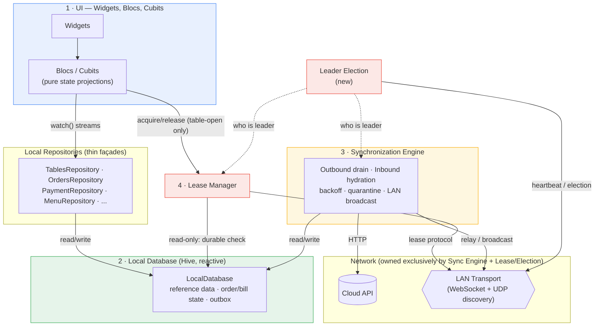
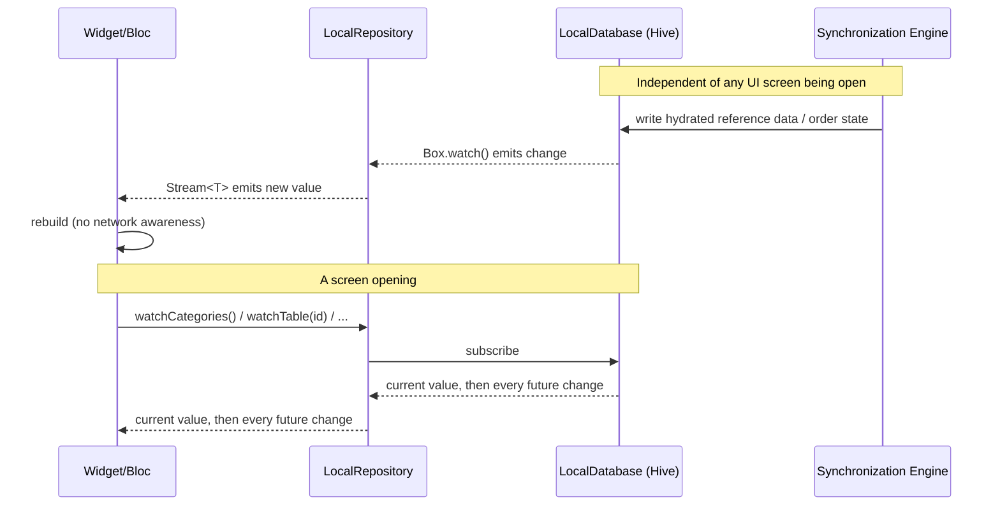
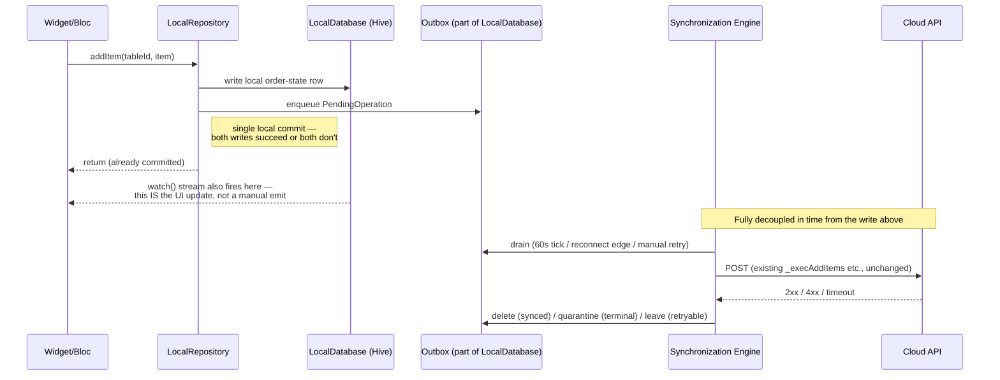
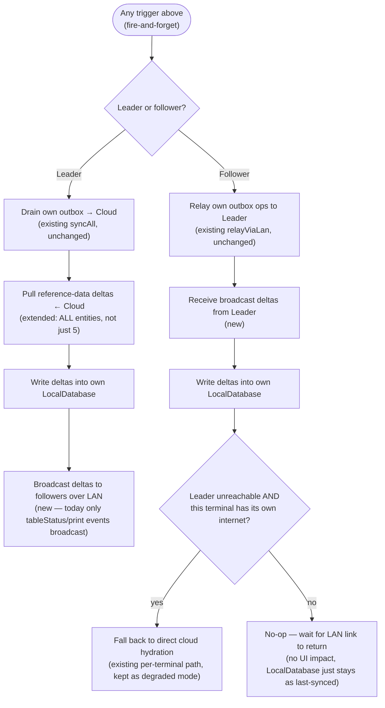
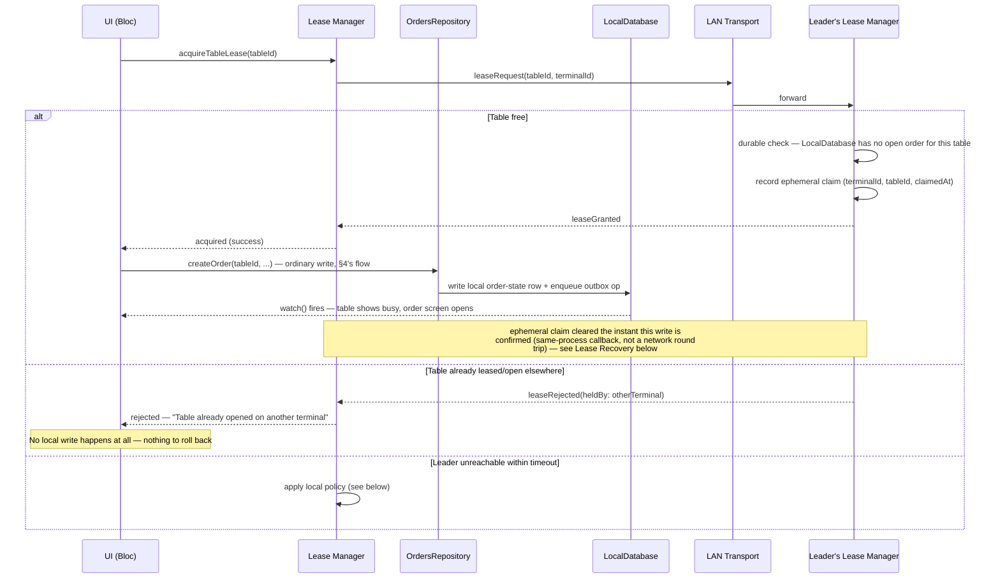
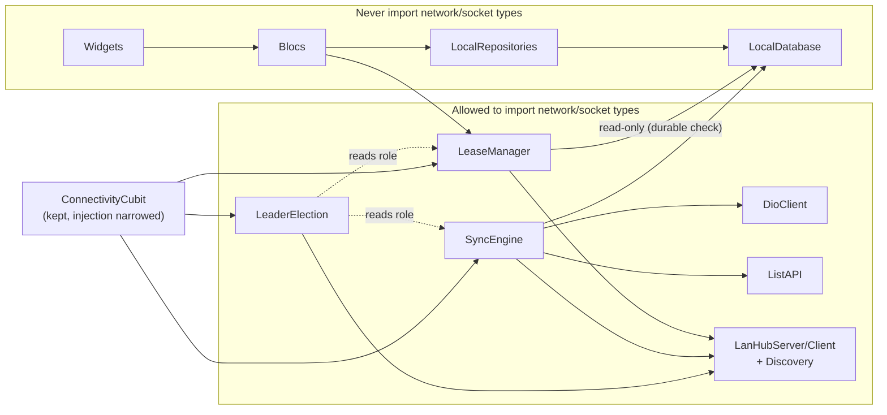

# Offline-First Target Architecture

**Status:** design only — no implementation in this document.
**Supersedes, for design purposes:** `offline-first-remediation-plan.md`'s Phase 3
premise ("the enqueue-on-`ConnectionFailure` pattern is correct, just relocate the
call site"). This document rejects that premise. Relocating *where* the HTTP call
happens without changing *when* the UI gets its answer is not offline-first; it's the
same coupling with a different address. See `offline-first-violations-audit.md` for
the violation inventory this design closes for good, not by patching each site.

**Companion, for current-state facts:** everything below about what exists today
(`SyncEngine`, `OfflineQueueService`, `CacheService`, `LanHubService`) was re-read from
source for this document (not assumed from the prior audits) — see file:line citations
throughout.

**Revision note (review passes 2-5):** this document went through four rounds of
targeted adversarial review — leader election, lease recovery, sync triggers,
`LocalDatabase` write ownership, and conflict resolution (round 1); then a pass
checking round 1's own fixes against actual source rather than just internal
consistency (round 2); then a third pass on round 2's additions (round 3). All three
rounds' fixes are applied below, not just described: §5 is rewritten event-primary
with an explicit fire-and-forget rule; §6's `LeaseManager` no longer writes
`LocalDatabase` (§9's `OrdersRepository` does, as an ordinary follow-up step after a
grant — this was a real defect in the first draft, a second writer for data one
component already owns) and gained a full Lease Recovery subsection, including a
disclosed-not-hidden leader-crash-mid-relay race and its fix; §7 gained epoch fencing
with persistence, concrete reconciled timing, and priority-uniqueness handling; §10's
dependency graph reflects the read-only `LeaseManager`→`LocalDatabase` edge; §12
(Conflict Resolution Policy) and §13 (known implementation gaps) are new. §12 itself
was corrected once after its first draft assumed two problem shapes — "discount vs.
payment" as an outbox race, an existing print function already producing cancellation
notices — that turned out not to match this codebase. A fourth pass then refined §13's
own two gaps further: the 409-merge fix narrowed to `_execCreateOrder` alone (with the
concrete mechanism — reuse `extractExistingOrderIdFromConflict`, fresh
`client_item_id`s at merge time — spelled out as a plan, not implemented), and the
kitchen-cancellation gap split into its template half (a `cancelled: bool` flag) and
its larger, still-open half (no call site exists to use that flag from at all — new
open question 5). No change to the four-component shape or the philosophy in §1
through any of this — every round corrected or sharpened specifics, never the
architecture itself, and §13 remains a plan for future work, not code applied here.

---

## 0. What already exists and what it's worth keeping

Before proposing new components, an honest inventory of the three that already exist,
because the target architecture reuses two of them almost as-is and reveals the third
is architecturally short of what its own name implies:

| Component | File | Verdict |
|---|---|---|
| Outbox (`OfflineQueueService`) | `lib/core/services/offline_queue/offline_queue_service.dart` | **Keep, mostly as-is.** Real Hive-backed queue, 7 typed ops, exponential backoff+jitter, dependency-ordered replay (`createOrder` before `addItems` before `closeShift`, `offline_queue_service.dart:144-152`), quarantine box for terminal failures. This is genuinely the write-side of a Synchronization Engine already. |
| Periodic driver (`SyncEngine`) | `lib/core/sync/sync_engine.dart` | **Keep the shape, extend the coverage.** 60s tick, drains the outbox, bulk-hydrates categories/departments/halls/tables/users (`sync_engine.dart:141-184`). Gaps: goods-by-category, order/bill detail, ingredients, compounds, service charge, transaction groups, printer settings, menu images have **no** hydration path here — each is fetched ad hoc by whichever screen needs it (this is V4-V6, V9 in the violations audit). Also: in LAN `client` mode, reference-data hydration still gates on *this terminal's own* `_connectivity.isOnline` (`sync_engine.dart:110`), not on leader reachability — a follower with a dead internet link but a live LAN link to the leader currently cannot refresh reference data at all, only replay its outbox via relay. |
| LAN transport (`LanHubService`) | `lib/core/services/lan_hub/lan_hub_service.dart` | **Keep the socket transport, replace the role-assignment model.** Real WebSocket server/client, auth-gated (`_validateIncomingAuth`, `lan_hub_service.dart:179-202`), a working message protocol (`LanHubMessage`, tagged-union style — `tableStatus`, `printJobAnnounce/Claim/Result`), a UDP discovery beacon, even a conflict *detector* for two servers on one branch. **But `LanMode` (`disabled`/`server`/`client`) is a manually-set admin toggle, not an election** — `setMode()` is called from a settings screen, and `_watchForConflicts()` explicitly documents that it only warns, never resolves (`lan_hub_service.dart:118-123`: *"automatically demoting one side would need picking a winner with no reliable criteria... this is a call for whoever's staffing the branch"*). **There is no automatic failover today.** If the `server` terminal goes down, every `client` just sits disconnected until a human reconfigures one of them. This directly contradicts the spec's Leader Failover requirement and is the single largest net-new component this design needs (§7). |

And one component the spec assumes exists that **does not exist at all today**:

| Missing | Evidence |
|---|---|
| **Lease Manager** | Table "ownership" today is enforced by the *cloud backend's* 409 response to `POST /orders` when online (`create_order_bloc.dart:213-227`, `extractExistingOrderIdFromConflict`), and by **nothing** when offline — `_handleOfflineOrder` (`create_order_bloc.dart:300-361`) writes a queued `createOrder`/`addItems` op with zero coordination check. Two terminals opening the same table while both offline, or while LAN-partitioned from each other, can double-open it today. This is exactly the race the spec's Lease Manager exists to close, and it has to be built new (§6). |

And one gap underneath all of it: **there is no reactive local database.** `CacheService`
(`lib/core/services/cache/cache_service.dart`) is a flat Hive key-value store of raw
JSON blobs — `getCategories()`, `getGoods()`, `getGoodsForCategory(id)` are imperative
reads, called once and re-called manually. Every Bloc that wants "cache-first" hand-rolls
the same shape: read blob → emit → maybe await network → write blob → emit again
(`main_cubit.dart:55-96`, `detail_bloc.dart:125-181`, `payment_bloc.dart:396-457`, all
independently). That duplication isn't a style problem — it's *why* the network call
ends up inline in the Bloc in the first place: nothing lower in the stack can tell the
Bloc "the data changed, rebuild yourself." §1's Local Database fixes this at the root.

---

## 1. Target architecture

Four components, same names the spec uses, mapped onto concrete ownership of what
exists in this codebase today plus what's net-new.

### 1. UI (Widgets + Blocs/Cubits)
Depends on exactly two things: **LocalRepository** interfaces (reads via `Stream`,
writes via a method that returns once the local write is committed) and, for the one
coordinated operation, **LeaseManager**. Zero references anywhere in
`lib/features/**/presentation/**` or `lib/features/**/cubit/**` to `DioClient`,
`ListAPI`, `ConnectivityCubit`, `LanHubService`, or `OfflineQueueService`. No Bloc holds
a throttle map, a `_lastFetchAt` timestamp, or an `isOnline` branch — that machinery is
deleted, not relocated (§8 is explicit per file about what gets deleted).

### 2. Local Database (evolved `CacheService` → `LocalDatabase`)
**Recommendation: keep Hive as the storage engine, not a swap to Drift/Isar.** The
existing test suite already runs against real Hive boxes with no mocking (see
`offline-first-remediation-plan.md` §9), `PendingOperation` is already a `HiveObject`
with generated adapters, and Hive already supports the one primitive this design
actually needs — `Box.watch()`/`Box.listenable()` — which `OfflineQueueService.listenable`
(`offline_queue_service.dart:48`) and the print-queue/LAN client-count notifiers already
use elsewhere in this codebase. The gap isn't the storage engine, it's that this
reactivity stops at infrastructure boundaries and never reaches a Bloc. Closing that gap
is a schema/API change (one typed `Box<T>` per entity + a uniform
`Stream<List<T>> watchAll()` / `Stream<T?> watchById(id)` surface replacing today's
`getX()`/`saveX()` blob pairs), not a storage migration. Revisit Drift only if a screen
needs a real relational join `LocalDatabase` can't express efficiently — none of the
current violations do; "goods filtered by category" is a single indexed lookup, not a
join.

`LocalDatabase` becomes the **one and only** place any of these live: reference data
(categories, departments, halls, tables, goods, goods-by-category, users, ingredients,
compounds, service charge, transaction groups, printer settings, menu images), live
order/bill state (today's ad hoc `saveOrderDetail` becomes a first-class table, not a
per-tableId blob assembled differently in three Blocs), and the outbox itself
(`PendingOperation` already lives here — it just needs to be recognized as part of the
same database, not a parallel structure). **This is what "exactly one database" means in
practice**: one Hive instance, many typed boxes, one facade — not `CacheService` +
Bloc-local `state.existingGoods` + a live network response as three simultaneous
sources of truth for the same table's bill, which is what happens today (`DetailBloc`'s
`existingGoods` is Bloc-only in-memory state built from a live
`GET /order-items/order/{id}`, with no durable local record — a restart mid-service
loses it; only `PaymentBloc`'s ad hoc `saveOrderDetail` cache partially covers this, and
only for the payment screen).

### 3. Synchronization Engine (`SyncEngine` + `OfflineQueueService` + the network-facing
half of `LanHubService`, unified)
The **only** component with a `DioClient`, `ListAPI`, or the LAN transport's cloud/relay
surface in its dependency graph. Owns:
- Outbound: draining the outbox (existing `syncAll`/`relayViaLan`, unchanged).
- Inbound: hydrating **every** reference-data entity into `LocalDatabase` — extending
  today's five (`sync_engine.dart:150-159`) to cover the currently-uncovered ones
  (goods-by-category, order/bill detail for open tables, ingredients, compounds,
  service charge, transaction groups, printer settings, menu images).
- Reconnect/backoff/quarantine (existing, unchanged).
- **New:** when a leader, periodically diffing and broadcasting `LocalDatabase` deltas
  to followers over the LAN transport — today only `tableStatus` and print-job events
  broadcast; everything else waits for each follower's *own* cloud connectivity
  (`sync_engine.dart:110` gates follower hydration on the follower's own `isOnline`,
  even though the whole point of LAN mode is that a follower shouldn't need its own
  internet).

### 4. Lease Manager (new)
A thin component sitting next to `LocalDatabase`, talking to the Synchronization
Engine's LAN transport (reusing the existing socket/message-protocol machinery in
`LanHubServer`/`LanHubClient`/`LanHubMessage` — same pattern `printJobAnnounce`/
`printJobClaim` already established, just new message variants). Exposes exactly one
narrow surface to the UI: `acquireTableLease(tableId) -> LeaseResult`,
`releaseTableLease(tableId)`. Nothing else in the app calls it — per the spec, this is
the *only* operation requiring coordination (§6).

---

## 2. Component diagram



The rule this diagram enforces visually: **only three boxes touch the network** (Sync
Engine, Lease Manager, Leader Election). Every arrow from UI terminates at
`LocalRepository`, `LocalDatabase`, or `LeaseManager` — never at `LAN` or `CLOUD`
directly.

---

## 3. Read data flow



No step in this flow can await a `Future` that resolves from an HTTP response. A screen
that opens while fully offline gets exactly the same stream, with whatever value
`LocalDatabase` last held — there is no "loading" state that means "waiting on the
network," only "no value written yet," which is indistinguishable online or offline.
This is what makes V4/V5/V6 architecturally closed rather than patched: there is no
Bloc-level `if (!isOnline) return` branch to write, because the Bloc never had a
network call to gate in the first place.

---

## 4. Write data flow



The critical difference from today's code: **the UI's "success" state and the local
commit are the same event.** Today, `emit(Status.SUCCESS, success: true)` happens after
`await usecase.call()` resolves (online) or after `_handleOfflineOrder` enqueues
(offline) — two different code paths converging on the same emit. In the target flow
there is only one path: the local write resolves (it's Hive, it's fast, it's never
gated on a socket), the stream fires, the UI is already showing the new state. Whether
`Sync` above ever successfully reaches `Cloud` in the next second, the next minute, or
the next hour is invisible to everything above the `Queue` line.

---

## 5. Synchronization flow

**Triggers — event-primary, not timer-primary.** The 60s tick exists for one reason:
`SyncEngine`'s own doc comments already explain it — "the outbox drains even without a
connectivity false→true edge," covering the platform-quirk case where an OS callback
never fires. That's a safety net, not the mechanism, and framing it first (as an
earlier draft of this document did) implied the opposite. What actually drives
synchronization:

| Trigger | Behavior |
|---|---|
| Local write (every outbox enqueue) | Fires a sync pass immediately — near-real-time propagation in the common (online) case, and shrinks the lease-recovery race window in §6. |
| Reconnect edge (connectivity flips offline→online) | Immediate full drain attempt — there's likely a backlog. |
| LAN reconnect (follower reconnects to leader) | Immediate relay of pending ops *and* an immediate request for a fresh reference-data snapshot — doesn't wait for the leader's next broadcast cycle. |
| App startup | One immediate sync attempt, not "wait up to 60s after cold start" (mirrors the existing `AppScaffold._prefetchAttempted` reset-on-login precedent). |
| Manual retry | Already correctly modeled via the existing `force` parameter. |
| 60s timer | **Safety net only** — catches whatever an event trigger missed. Interval unchanged; it doesn't need to be fast, since the fast paths are now event-driven. |

**Every trigger above is fire-and-forget from the caller's perspective — the single
most important sentence in this section, stated explicitly rather than left
inferable.** §4's write flow already establishes that the local write returns success
independent of anything downstream ("Fully decoupled in time from the write above").
The local-write trigger is wired as *commit locally, then
`unawaited(syncEngine.tick())`* (or dispatched as a separate microtask) — **never**
`await syncEngine.tick()` inside the function that performs the commit. That shape —
awaiting a sync-adjacent call before returning success — is V1/V2/V3
(`offline-first-violations-audit.md`) verbatim, just triggered by a new event name
instead of an `isOnline` check; the document written to kill that bug class must not
reintroduce it through its own revision. No new debouncing/coalescing abstraction is
needed to make eager triggering safe: `_isSyncing`/`_tickRunning` and the existing
backoff (`offline_queue_service.dart:88-136`) already collapse re-entrant calls into
one no-op pass, so calling `tick()` liberally — even once per item added during rapid
order entry — is already cheap and safe by construction.



Backoff, jitter, quarantine, and the fixed op-type replay order
(`offline_queue_service.dart:144-152`) carry over unchanged — that logic is already
correct and belongs where it already lives. What's new is purely on the *inbound* side:
today a follower's reference-data freshness depends on its own internet
(`sync_engine.dart:110`); in the target flow it depends on the leader's internet,
relayed over LAN, with direct cloud hydration demoted to a fallback for when *both* the
LAN link and this terminal's own internet would otherwise leave it stale.

---

## 6. Lease acquisition flow

The one deliberate exception to "UI never waits on anything." The spec accepts this
explicitly (*"the only operation requiring coordination"*) — the honest reason a table
open can't be resolved from local data alone is that **it's the one case where two
different local databases might each think they're right**, and only asking somebody
who's talked to both resolves that.



**`LeaseManager` never writes business data — its job ends at yes/no arbitration.**
The order-open write belongs entirely to `OrdersRepository`, called as an ordinary
follow-up step, through the exact same single-local-commit-then-enqueue path every
other write in the app uses (§4). This keeps `LocalDatabase`'s order data on exactly
one writer regardless of whether the write was preceded by a lease check — the
alternative (`LeaseManager` writing directly, as an earlier draft of this diagram had
it) creates a second writer for data `OrdersRepository` already owns. No new
`LeaseRepository` and no persisted "leases" table are needed either — see Lease
Recovery below for why there's no durable lease-specific data left to own once the
write is assigned correctly. The Leader-side-only ephemeral claim map mirrors the
existing leader-executes-relayed-ops asymmetry already in this design
(`OfflineQueueService.executeRelayedOp`, `LanHubService._handleRelayOp`) — reused, not
reinvented.

**The unreachable-leader branch is a real product decision, not an engineering default
— flagging it rather than silently picking one:**

| Policy | Behavior | Risk |
|---|---|---|
| **Block (recommended default)** | Show "can't verify table ownership — no connection to leader" and refuse to open. | Cashier can't seat a table during a LAN outage. Matches the spec's own zero-tolerance stance: an unverifiable lease grant is exactly the double-booking risk this component exists to prevent. |
| Allow with a visible "unverified" flag | Open locally, mark the order as lease-unconfirmed, reconcile (and surface a conflict) once the leader is reachable again. | Reintroduces the double-open race the Lease Manager exists to close, just with a warning label instead of a block. |
| This terminal *is* the leader (solo mode) | No coordination needed — grant immediately against its own `LocalDatabase` lease table. | None — this isn't a fallback, it's the correct-and-only case when there's exactly one terminal. |

### Lease Recovery

The durable-check/ephemeral-check split in the diagram above is deliberately two
independent mechanisms, because only one of them needs to survive a leader failing:

1. **Durable check (must survive everything):** before granting, the leader asks its
   own `LocalDatabase` — kept current as a replica via §5's broadcast — "does an open
   order already exist for this table?" If yes, reject. This needs *zero*
   lease-specific persistence: the answer is ordinary business data
   (`OrdersRepository`'s own records), already durable, already replicated. It's
   naturally correct across leader restart, power loss, app crash, and failover, with
   no special recovery step, because there's nothing lease-specific to recover — this
   is what "rebuilding leases from durable state" actually buys, precisely.
2. **Ephemeral check (fine to lose on failover):** an in-memory
   `tableId -> (claimant, claimedAt)` map on the current leader, only for tables free
   in durable state but being raced on *right now* — two requests arriving within the
   same sub-second window, before either's resulting order-open write has propagated
   anywhere. Losing this map on failover only means an in-flight request retries —
   never a silent double-booking, since the durable check still applies to whatever
   *did* land. **Eviction, the normal case:** an entry is cleared the instant its
   corresponding durable write is confirmed — Lease Manager and `OrdersRepository` are
   called back-to-back from the same UI action (diagram above), a same-process
   callback, not a network round trip — with a short TTL (a few seconds) as a backstop
   for the path where that confirmation never arrives (the UI action was abandoned
   mid-flow).

**Per-scenario walkthrough:**
- **Leader restart / power loss / app crash:** the new process re-derives the durable
  check from `LocalDatabase`, already durably committed per §4's single-local-commit
  write flow. No special synchronization step needed — there's nothing lease-specific
  to reload.
- **Failover to a different terminal (§7):** identical logic, using that terminal's own
  replica.
- **Staleness direction:** a stale replica can only ever bias toward a **false reject**
  (thinks a just-freed table is still open — annoying, safe), never a **false grant**
  (thinks an open table is free — the actually dangerous direction), *provided*
  open/close-table events propagate promptly. This is exactly why §5 makes local
  writes fire-and-forget-immediate rather than timer-batched — the Lease Manager's
  safety depends directly on how fast that propagation is.

**The one race this doesn't close, disclosed rather than hidden.** This architecture is
hub-and-spoke only — satellites do not synchronize directly with each other, the only
path is Satellite ↔ Leader — so there is exactly one path for an order-open event to
reach the leader: relay. If Terminal A opens Table 5, commits locally, and the relay
toward the Leader is *in flight* when the Leader crashes, the newly-elected Leader's
replica has no record of it yet — its durable check says "free." A concurrent request
for Table 5 from Terminal C, arriving in that window, is granted. Two open orders now
exist for the same table. **Bounded, not eliminated:** requires (a) a leader crash, (b)
timed within one specific table's in-flight relay window, (c) a concurrent request for
that exact table in that window. Rare — and the resolution reuses existing logic rather
than inventing new machinery:

- The **online** path already handles the equivalent race correctly today:
  `create_order_bloc.dart:213-227` catches the backend's 409 on a duplicate table-open,
  extracts the winning order id (`extractExistingOrderIdFromConflict`), and merges —
  `bindActiveOrder` then attaches this terminal's items to the existing order. Clean,
  no data loss, no manual step.
- The **offline-replay** executors don't have this yet. `_execCreateOrder`
  (`offline_queue_service.dart:263-274`) falls through to `_isTerminalError`
  (`offline_queue_service.dart:442-449`, any 4xx including 409 treated as terminal) and
  lands in generic quarantine — a real entry, not silently lost, but with no link back
  to "this conflicts with order Y already open on this table," and no signal to the
  cashier in the moment (their local write already succeeded, per this whole
  architecture's premise). **Worse:** `_execAddItems` resolves its target order via
  `_getOpenOrderIdByTable(dio, op.tableId)`
  (`offline_queue_service.dart:277-297,426-439`) — a **tableId lookup**, not the
  specific order id the losing terminal believes it's using — so a losing terminal's
  already-queued item-adds would silently attach to the *winning* terminal's order,
  rather than merely being orphaned. Cross-order data contamination, not just a dropped
  op.
- **Fix (net-new implementation work this document surfaces, tracked in §13): give
  `_execCreateOrder` a 409-merge branch mirroring the online path's — `_execAddItems`
  needs no change.** `_execCreateOrder`'s payload (built by `_handleOfflineOrder`,
  `create_order_bloc.dart:340-356`, serialized by `CreateOrderRequestModel.request()`,
  `create_order_request_model.dart:25-44`) bundles this terminal's items inline with no
  per-item `client_item_id` at this stage — on a 409 today those bundled items are
  simply discarded (falls through to `_isTerminalError` → `_dropped`). The fix: extract
  the winning order id via the already-shared `extractExistingOrderIdFromConflict`
  (`lib/core/utils/order_conflict_helper.dart` — a pure function already used in 3
  other places, zero new dependency), generate fresh `client_item_id`s at merge time
  (there are none to reuse — this is genuinely their first submission attempt, the
  original create never landed), and POST the same items to the winning order via the
  add-items endpoint instead of dropping them. `_execAddItems` needs no equivalent
  change: it already resolves its target via `_getOpenOrderIdByTable(dio,
  op.tableId)` — "whichever order is actually open for this table" — which is the
  correct destination whether this terminal's own `createOrder` won or lost the race,
  once `_execCreateOrder` stops silently dropping the losing side's items. Routing by
  tableId isn't the bug here, it's the self-healing mechanism; naming both executors
  for this fix over-specified its scope. The unparseable-409 residual (no order id
  findable in the error body) falls through to today's existing `_dropped()`/quarantine
  path unchanged, pending open question 4 below.

---

## 7. Leader failover flow

**This does not exist today in any form.** `LanMode` is an admin-set toggle
(`lan_hub_service.dart:60-79`); `_watchForConflicts()` detects a second leader but
"deliberately warns only" (`lan_hub_service.dart:118-123`). Building this is the
largest single piece of net-new work in this plan.

```mermaid
sequenceDiagram
    participant T1 as Terminal A (current Leader, epoch 4)
    participant T2 as Terminal B
    participant T3 as Terminal C
    participant Disc as UDP Discovery Beacon

    loop Every ~2-3s
        T1->>Disc: leaderHeartbeat(branchId, priority, epoch=4)
    end
    Note over T2,T3: Both listening, both know who's leader and at what epoch

    T1--xT1: Terminal A goes down
    Note over T2,T3: 3 consecutive missed heartbeats (~6-9s) — leader considered dead

    T2->>T2: wait base + f(priority) before claiming
    T3->>T3: wait base + f(priority) before claiming
    Note over T2,T3: Higher priority waits less — hears no higher claim, proceeds;<br/>lower priority hears the higher claim first and stands down

    T2->>Disc: electionClaim(priority, epoch=5)
    Note over T2,T3: epoch = last-known-epoch + 1, read from persisted<br/>storage, not memory — survives T2's own restart too

    T2->>Disc: leaderClaim(epoch=5)
    T3->>T3: epoch 5 > last known (4) — accept T2 as leader, switch to follower/client mode
    T2->>T2: switch to server mode, start LanHubServer

    Note over T2,T3: Followers reconnect LanHubClient to T2's address<br/>(from the same discovery beacon, no manual IP re-entry)
    T3->>T2: reconnect, resume relay/broadcast as in §5

    T1--)T1: Terminal A comes back later, still believes epoch 4
    T1->>Disc: passively listens one heartbeat interval before acting<br/>(non-blocking — T1's own UI/local reads/writes continue normally)
    T1->>T1: hears T2's epoch 5 > its own persisted 4 — adopts T2 immediately,<br/>joins as follower (never re-claims just because it's back — avoids flapping)
```

Design choices worth being explicit about, since they're product/ops tradeoffs as much
as engineering ones:

- **Epoch/term fencing, persisted across restart.** Every heartbeat/claim carries a
  monotonically increasing epoch; higher epoch always wins immediately on both sides
  (adopt if you hear higher, step down if someone else's is higher than yours). This
  turns the existing "warn only" conflict detector (`lan_hub_service.dart:118-123`)
  into something that actually self-heals on partition recovery, not just flags it for
  a human. **The last-known epoch is persisted locally** — a single integer, e.g. in
  the same `SharedPreferences` store `SyncEngine` already uses for `_lastSyncKey`
  (`sync_engine.dart:35,45-49`) — and reloaded before trusting or emitting any
  heartbeat. Without this, a terminal that restarts (app update, OS reboot,
  crash-relaunch — ordinary events on POS hardware) has no memory of the epoch it last
  saw and can't distinguish a stale re-broadcasting leader from a current one, which
  defeats fencing at exactly the moment — restart — it matters most.
- **Priority, not recency, with jitter to avoid simultaneous claims.** The terminal
  that comes back online first after a leader loss should not automatically reclaim
  leadership — that would cause flapping if two terminals are power-cycling
  near-simultaneously (e.g. a building-wide brief outage). Priority is a small
  configured integer (or a stable fallback like terminal-id) set once per terminal. On
  heartbeat timeout, a candidate waits `base + f(priority)` before claiming — higher
  priority claims sooner, and a candidate that hears a higher-priority claim during its
  own wait stands down instead of claiming (standard bully-algorithm collision
  avoidance — no vote round, no quorum). **Priority uniqueness is enforced at config
  time** (the settings screen rejects a value already claimed by another terminal it
  can currently see on the branch) **but this only catches collisions between
  terminals mutually reachable at config time** — two terminals provisioned
  independently before ever sharing a network (configured at a warehouse and shipped
  to different branches, or simply set up offline) can still collide. The terminal-id
  tiebreak is therefore not redundant insurance the config-time check makes obsolete —
  it remains the actual load-bearing guarantee against a duplicate-priority collision;
  the config-time check is a best-effort UX nicety that catches the common case
  earlier, nothing more.
- **Concrete timing, reconciled against §6.** Heartbeat interval ~2-3s; 3 consecutive
  misses (~6-9s) before a leader is considered dead — long enough to absorb transient
  Wi-Fi packet loss, short enough to bound the cashier-visible cost. That cost is worth
  stating plainly rather than leaving it to fall out of two sections read in isolation:
  §6 recommends "Block" as the default when a lease request can't reach a leader, so
  **every table-open attempt anywhere on the LAN is blocked for up to ~9s during a
  real leader failure.** No other operation is affected — items, payments, cancels
  never depend on the leader by design. This is consistent with, not a violation of,
  the architecture's own stated exception: table-open is already the one operation
  permitted to depend on the network at all; a bounded ~9s worst case during a rare
  crash is the accepted cost of that exception, not a new one.
- **Reconnection re-discovery is non-blocking.** A terminal returning to the LAN (app
  restart, Wi-Fi drop/reconnect) does not trust its last-known leader/epoch from before
  the gap — it passively listens for one heartbeat interval first, then either confirms
  its existing belief or adopts whichever leader/epoch it actually hears. This
  listening window does not block the terminal's own UI or local reads/writes — it
  keeps functioning normally throughout, exactly as it would while fully offline, per
  the Golden Rule.
- **No manual mode toggle left in the UI.** The existing `sync_status_section.dart`
  (already added on this branch, currently unread by this document but named in the
  diff) should surface *current* role (leader/follower/who) as a read-only reactive
  status — same "UI reads from LocalDatabase" rule applies to this screen too: the
  Leader Election component writes its own status into `LocalDatabase`, the settings
  screen watches it, rather than polling `LanHubService.mode`/`clientCount` getters
  directly as it likely does today.
- **The discovery beacon becomes the heartbeat channel**, not a separate mechanism —
  it already exists (`lan_discovery_service.dart`, used today for hub-conflict
  detection and the settings-screen picker), it just needs a liveness timeout added on
  top of what's already a periodic broadcast.
- **Split-brain is bounded and self-healing, not eliminated — true both for the
  election transition and for a genuine physical LAN segment split.** During an
  election transition, in-flight writes just queue locally exactly as they would
  during any LAN partition — existing outbox behavior, nothing new. A true segment
  split (two physically separated switches) can produce two independently-operating
  leaders for the duration of the split; this is not preventable without quorum, and
  quorum is meaningless with as few as 2 terminals. Each side keeps working locally per
  this architecture's own design regardless, and the epoch rule above makes
  reconnection self-healing rather than requiring a human to notice and reconfigure,
  which is the limit of what `_watchForConflicts()` does today.

---

## 8. Migration plan (current architecture → target architecture)

Phased by **which architectural guarantee it buys**, ordered so every phase leaves the
app in a shippable state — not by file-count or "easy wins first."

**Phase 0 — Make the Local Database real.**
Introduce typed, reactive Hive boxes behind a `LocalDatabase` facade (§1.2). Purely
additive: `CacheService`'s existing blob methods keep working while `LocalDatabase`'s
`watchX()` streams are added alongside. No Bloc changes yet. This phase has no user-
visible effect and exists solely so Phase 2 has something to build on.

**Phase 1 — Synchronization Engine absorbs every reference-data entity + becomes the
sole network owner.**
Extend `SyncEngine._hydrateReferenceData()` to cover goods-by-category, order/bill
detail for open tables, ingredients, compounds, service charge, transaction groups,
printer settings, menu images — writing into `LocalDatabase`, not `CacheService`'s
blobs. Fold `OfflineQueueService` and the network-facing parts of `LanHubService` into
the same "Synchronization Engine" conceptual boundary (they can stay as separate Dart
classes; what matters is nothing outside this boundary imports `DioClient`/`ListAPI`).
Add a CI check (a grep-based import-boundary lint is enough — no need for a new
tooling dependency) that fails if `DioClient`/`ListAPI`/`Dio` ever appears under
`lib/features/**/presentation/**` or `lib/features/**/cubit/**` again.

**Phase 2 — Rewrite the six core Blocs against `LocalRepository`/`LocalDatabase`
streams. This is where V1–V6 actually close, not relocate.**
`CreateOrderBloc`, `PaymentBloc`, `DetailBloc`, `MainCubit`, `ShiftBloc`: delete every
`await *Usecase.call()`, every `_connectivity.isOnline` branch, every throttle map
(`_lastHallFetchAt`, `_lastCategoriesFetchAt`, `_lastCategoryFetchId/At`,
`_lastAllTablesFetchAt`, `_lastHallsFetchAt` — all of them, no replacement, staleness
policy moves entirely into Sync Engine's TTL). Replace with `watchX()` subscriptions
for reads and single `LocalRepository.doX()` calls for writes (§4's flow). The existing
`Usecase` classes (`CreateOrderUsecase`, `GetHallsUsecase`, etc.) are deleted — their
logic either becomes trivial (`LocalRepository` write) or moves into Sync Engine's
existing `_exec*` executors, which mostly already have the right shape.

**Phase 3 — Build Lease Manager, wire it to the one call site that needs it.**
New LAN message variants (`leaseRequest`/`leaseGranted`/`leaseRejected`), new
`LeaseManager` class, `CreateOrderBloc`'s table-open path (only) routes through
`acquireTableLease` before the local write. Every other write in the app (items,
payment, discounts, cancel) stays exactly as Phase 2 left it — untouched, because the
spec is explicit this is the *only* operation needing this.

**Phase 4 — Leader Election / automatic failover.**
Replace the manual `LanMode` admin toggle with the election protocol in §7. Largest
isolated chunk of new code; can ship after Phase 3 without blocking it (today's manual
failover — a human reconfigures — keeps working as the fallback until this lands).

**Phase 5 — Back-office tier (menu, staff, halls/tables structural edits, transactions,
service charge) onto the same `LocalRepository` + outbox pattern.**
This is `offline-first-compliance-audit.md`'s C1 (nine widgets, zero offline logic
today) — same pattern as Phase 2, applied to screens that currently have no offline
behavior to preserve, so there's no "old branch to re-derive line-by-line" risk here,
only new code.

**Phase 6 — Delete what's now dead.**
`Timer.periodic` in `archive_screen.dart:56`/`waiter_floor_plan_screen.dart:75` (V8) —
gone, those screens are stream consumers now. `FutureBuilder` in
`menu_manage_screen.dart:2432` (V9) — gone, menu images hydrate via Phase 1. Whatever's
left of `main_repository_impl.dart`'s ~60 bare-passthrough methods (V7) either becomes
Sync Engine-internal (moved, not deleted — it's still the right place to make the
actual HTTP calls, it just stops being something the UI layer can reach) or is deleted
outright if Phase 2/5's `LocalRepository`s made it redundant.

---

## 9. Per-feature violation remediation

| Violation | Why it violates offline-first | New data flow | Owning layer | Delete | Move | New abstraction |
|---|---|---|---|---|---|---|
| **V1** Order creation (`create_order_bloc.dart:104-243`) | Awaits live POST before emitting success whenever online; queue is an exception path, not the path. | §4 write flow — local commit + outbox enqueue, single path regardless of connectivity. | `OrdersRepository` (new) writes; Sync Engine executes (existing `_execCreateOrder`, unchanged). | `_connectivity.isOnline` branch, `await _createOrderUsecase.call()`, the online/offline fork entirely. | `CreateOrderUsecase`'s HTTP logic → already lives in `_execCreateOrder`; nothing to actually move. | `OrdersRepository.createOrder()` — one method, no online/offline parameter. |
| **V2** Payment (`payment_bloc.dart:141-224`) | Same shape as V1, for the highest-stakes write in the app. | Same as V1. | `PaymentRepository` (new). | `await _createPaymentUsecase.call()`, `await _mainRepository.cancelOrder()`, both `ConnectionFailure`/`isConnectivityIssue` branches. | HTTP logic → `_execPayOrder`/`_execCancelOrder` (already exist). | `PaymentRepository.pay()`, `.cancelZeroTotal()`. |
| **V3** Item add/cancel/qty (`detail_bloc.dart:634-887`) | `existingSyncingNames` button-disable is a soft blocking spinner driven by an awaited HTTP call in a Bloc. | Local write is instant; buttons re-enable the instant the local write (not the network call) completes. | `OrdersRepository` (shared with V1). | `await _mainRepository.cancelOrderItem/createOrderItems()` inline, `_isConnectionIssue` catch branch, the disable-until-response pattern. | HTTP logic → `_execAddItems`/`_execCancelLineItems` (already exist). | Same `OrdersRepository`, `.addItems()`/`.cancelItems()`. |
| **V4** Halls/tables (`main_cubit.dart:55-243`) | Cubit itself decides to hit the network, owns its own throttle. | §3 read flow — pure `watchTables()`/`watchHalls()` subscription. | `TablesRepository` (new); Sync Engine owns hydration/TTL. | Entire `_getTablesByHallId`/`getHalls`/`loadAllHallsTables` network-await bodies, all throttle maps, `_connectivity` field. | Fetch logic → Sync Engine's `_hydrateReferenceData` (extended). | `TablesRepository.watchTables(hallId)`, `.watchHalls()`. |
| **V5** Categories/goods (`detail_bloc.dart:125-181,958-1027`) | Same shape as V4, plus per-category throttle reinvented again. | Same as V4. | `MenuRepository` (new). | `_onGetCategories`/`_onSetSelectedCategoryId` network-await bodies, throttle fields. | Fetch logic → Sync Engine (goods-by-category hydration is new coverage, §8 Phase 1). | `MenuRepository.watchCategories()`, `.watchGoodsForCategory(id)`. |
| **V6** Bill/order detail (`payment_bloc.dart:396-512`) | Zero Sync Engine coverage — pure fetch-on-open, the purest form of the forbidden pattern. | Order/bill state becomes a first-class `LocalDatabase` table, kept current by every local write (V1/V3) — not re-derived from the network at all once local-first writes exist. | `OrdersRepository` (shared). | `_onGetDetail`'s entire network-await body, `if (!isOnline) return`. | Nothing to move — per the audit's own V6 fix note, this fetch shouldn't exist anywhere once writes are local-first; it's not relocated, it's deleted. | None needed — this is deletion, not abstraction. |
| **V7** Repository layer (`main_repository_impl.dart`, ~60 methods) | No consistent offline behavior to inherit; new code built against it inherits nothing. | N/A — foundational, not a feature. | Split: reads move to per-domain `LocalRepository`s (§1); writes move to Sync Engine's internal HTTP layer. | The UI-facing `MainRepository` interface itself. | The class `main_repository_impl.dart` → becomes Sync Engine-internal, no longer implements a UI-reachable interface. | Per-domain `LocalRepository` interfaces (`TablesRepository`, `MenuRepository`, `OrdersRepository`, `PaymentRepository`, `StaffRepository`, ...). |
| **V8** Polling widgets (`archive_screen.dart:56`, `waiter_floor_plan_screen.dart:75`) | Second/third clock duplicating Sync Engine's tick. | Screens become `StreamBuilder`/Bloc-stream consumers — rebuild when `LocalDatabase` changes, not on a timer. | `LocalRepository` (whichever domain each screen reads). | Both `Timer.periodic` blocks, entirely. | Nothing — there's no logic here worth keeping, the tick already exists in Sync Engine. | None. |
| **V9** `FutureBuilder` image fetch (`menu_manage_screen.dart:2432`) | Named verbatim as forbidden in the spec. | Menu images hydrate into `LocalDatabase` (as bytes or a local file path) via Sync Engine, same as any other reference data. | `MenuRepository`. | The `FutureBuilder<Uint8List?>` widget entirely. | `MinioService.instance.getImageByObjectName` call → Sync Engine's hydration pass. | `MenuRepository.watchImage(objectName)`. |
| **Back-office CRUD** (menu/staff/halls-tables/transactions/service-charge — `offline-first-compliance-audit.md` C1) | Zero cache, zero queue, zero offline behavior today — not a violation of a working pattern, an absence of one. | Reads: §3 flow via the new per-domain repositories (Phase 5). Writes: real product decision — recommend online-required-with-clear-blocked-state for v1 (conflict policy for concurrent structural edits to shared reference data is a separate design question, not one this document resolves by default), same reasoning `offline-first-remediation-plan.md` §6 already reached. | `MenuRepository`/`StaffRepository`/`TablesAdminRepository`/`TransactionsRepository` (all new). | Direct `DioClient`/`MinioService` calls from these nine widgets. | HTTP logic → Sync Engine-internal (or a dedicated admin-write executor, since these aren't outbox-queued in v1). | New repositories per §8 Phase 5; no lease/queue abstraction for writes until a conflict policy is explicitly scoped. |

---

## 10. Dependency graph



`LeaseManager`'s edge into `LocalDatabase` is read-only (§6) — no `LeaseRepository`
exists in this graph because there's no durable lease-specific data left to own once
the order-open write is correctly assigned to `OrdersRepository`; adding one would be
an abstraction with nothing to hold.

`ConnectivityCubit` is not deleted — it's real, useful signal for exactly three
consumers (deciding when to attempt a sync pass, when to time out a lease request, when
to attempt direct-cloud fallback in §5). It is removed from every other injection site
in the app; today it's constructor-injected into `CreateOrderBloc`, `PaymentBloc`
(implicitly via `inject<ConnectivityCubit>()`), `DetailBloc`, and `MainCubit` — all four
lose that dependency in Phase 2.

---

## 11. Step-by-step implementation order (regression-minimizing)

Reuses the rollout mechanics `offline-first-architecture-plan.md` §11 and
`offline-first-remediation-plan.md` §9 already established for this codebase (real
Hive/real sockets/`fake_async` tests, feature-flag per phase, one low-volume branch
canary, field-proof window) — no new process, just applied to this design's phases:

1. **Phase 0** (Local Database facade) — additive, ships dark, no flag needed since
   nothing reads from it yet. Acceptance: `LocalDatabase` unit tests (real Hive boxes)
   for every new `watchX()` stream.
2. **Phase 1** (Sync Engine full hydration + import-boundary CI check) — ships dark for
   the new entities (nothing reads them yet either), but the CI check goes live
   immediately since it can only fail on *future* violations, not existing ones (the
   six Blocs still import `DioClient`-adjacent usecases at this point — exempt
   `lib/features/**/presentation/cubit/{create_order,payment,detail,main,shift}/**`
   from the check until Phase 2 lands, then remove the exemption in the same PR that
   finishes Phase 2).
3. **Phase 2** (rewrite the six Blocs) — the only phase touching live money/order
   paths. One Bloc at a time, each behind its own flag if the existing flag
   infrastructure supports per-Bloc granularity, otherwise one PR per Bloc reviewed
   against the old implementation line-by-line (same discipline
   `offline-first-remediation-plan.md` §5 already prescribed for its smaller version of
   this change). `CreateOrderBloc` first (highest write volume, best regression
   signal), `PaymentBloc` second (highest stakes, wait for `CreateOrderBloc`'s
   canary window to clear first), `DetailBloc`/`MainCubit`/`ShiftBloc` after.
4. **Phase 3** (Lease Manager) — additive new component; wire into
   `CreateOrderBloc`'s table-open path only after Phase 2's rewrite of that same Bloc
   has already proven stable, not in the same change.
5. **Phase 4** (Leader Election) — independent of 1-3, can run in parallel starting
   after Phase 0. Ships behind the existing manual `LanMode` toggle as a fallback until
   its own canary window clears, then the manual toggle is removed.
6. **Phase 5** (back-office tier) — independent of 1-4 except for reusing Phase 0's
   `LocalDatabase` facade; can start any time after Phase 0.
7. **Phase 6** (delete dead code) — last, and only after each corresponding phase's
   canary window has fully cleared, not opportunistically mid-migration.

Each phase's acceptance gate: `flutter analyze` clean, the import-boundary check green
for the files that phase touches, and — since these are live order/money paths for
Phases 2-3 — a manual re-read of every replaced branch against its pre-migration
behavior, the same bar this codebase's prior offline work already held itself to.

---

## 12. Conflict Resolution Policy

Not a distributed-systems subsystem — six practical rules, because most of the actual
mechanisms already exist in this codebase scattered per operation type (client-
generated idempotency keys, 404-as-success tolerance, FIFO-within-type replay) without
being named as a policy new operation types are expected to follow.

1. **Idempotency via client-generated IDs is the primary defense** against duplicate
   and replayed operations — generate once per user action, reuse on every retry,
   backend dedupes by that ID. Already the pattern for order/item creation
   (`create_order_bloc.dart:102,164`, `clientOrderId`/`client_item_id`, threaded end to
   end through retries). **Concrete gap found in the existing code:**
   `_enqueuePayment`'s payload (`payment_bloc.dart:296-323`) has no client-generated
   idempotency key at all — a retried `payOrder` POST (e.g. a timeout after the charge
   actually landed) has no dedup key for the backend to catch a duplicate charge on.
   Recommend adding a client-generated payment id, mirroring the existing pattern. This
   is the single most safety-critical finding in this document — it's money.
2. **Last-write-wins for item quantity/comment edits is an explicit low-stakes
   acceptance, not a claim the table lease prevents the race.** It doesn't: §6 gates
   only the *open* action, never re-checked afterward — §4's generic write flow (item,
   discount, payment) has zero LeaseManager involvement. Concurrent multi-terminal
   writes to an already-open order — floor terminal adding items, back-office applying
   a discount, register processing payment — are architecturally possible and, for a
   real restaurant, a normal operating pattern, not an edge case. LWW is accepted here
   specifically because losing one quantity/comment edit is low-stakes (visibly wrong
   for a moment, corrected on next glance, never money) — and because extending the
   lease to cover every write would reintroduce exactly the kind of cloud coordination
   into normal UI operations this whole design exists to avoid. The source architecture
   deliberately scopes coordination to "only tables," not ongoing order edits.
3. **Update-vs-delete: delete wins, "already gone" (404) is success, not failure** —
   generalizes the existing `cancelOrderItem` tolerance to a rule any new op type must
   follow. Ordering is already correctly FIFO-within-type via the existing `createdAt`
   sort (`offline_queue_service.dart:41-42`).
4. **Coalesce same-key in-place updates before they're ever queued, key namespaced by
   operation type.** Five rapid quantity taps while offline shouldn't enqueue five ops
   — but a coalescing key of bare `tableId+itemId` can collide across op *types*: an
   `update` and a `cancel` for the same item could compute to the same physical Hive
   key, letting a later update silently overwrite an unprocessed delete — violating
   rule 3 through a different mechanism than the ordering concern it otherwise
   addresses. Namespace it: `"update:{tableId}:{itemId}"` vs.
   `"cancel:{tableId}:{itemId}"`. `PendingOperation` has no top-level `itemId` field
   (`pending_operation.dart:24-49` — just `id`, `type`, `payload`, `tableId`,
   `createdAt`), so this is a call-site convention, not a queue-level feature: the
   `LocalRepository` write method sets the op's `id` to the deterministic, namespaced
   string itself instead of calling `OfflineQueueService.newId()`, and
   `Box.put(op.id, op)`'s existing overwrite-by-key behavior does the rest. Scoped to
   in-place updates only — never creates/deletes/payments, each a distinct real event.
5. **Quarantine is the correct, deliberate fallback for genuinely ambiguous cases** —
   already built (`offline_queue_service.dart`'s quarantine box), already correct.
   Explicitly "reject over-engineering" applied to conflict resolution: surfacing the
   rare unresolvable case to a manager is the right answer, not a fancier automatic
   merge. It should be the *last* resort after a type-specific merge attempt (rule 3,
   and §6's merge-on-409 fix), not the first thing a losing-race op falls into.
6. **The table lease already does most of the conflict-prevention work for the specific
   open action** — dedup (rule 1) + tolerant-terminal-state handling (rule 3) + FIFO +
   coalescing (rule 4) + quarantine (rule 5) is the whole practical toolkit this system
   needs for everything after that point. No CRDTs, no vector clocks.

Two cases worth naming explicitly, because they sound like they need their own rule and
don't, or do need one but not the one it's tempting to reach for:

- **Discount vs. payment collapses into rule 1 — there is no race to arbitrate.**
  `PendingOperationType` (`pending_operation.dart:6-21`) has exactly 7 values, no
  discount type; every discount code path (`payment_bloc.dart:118-138`,
  `_updateDiscountAmount`/`_updateDiscountType`) is local Bloc state, never enqueued on
  its own — discount only becomes part of a write when `_enqueuePayment` bundles
  `discount_amount`/`discount_percent` directly into the same `payOrder` payload
  (`payment_bloc.dart:296-323`). There are never two ops to order relative to each
  other. What's real: two terminals independently submitting payment for the same
  order is just two `payOrder` ops racing — rule 1's territory, nothing new needed.
- **Kitchen status vs. cancelled order needs net-new work on two separate fronts, not
  one.** The right rule is still a printing/notification one, not a data-merge one:
  don't try to "unprint" a ticket the kitchen already has. **Front 1, template:**
  `printKitchenReceiptFor`/`buildWithHeader` have no cancellation mode today — verified
  directly (`printer_service.dart:439-446`, `kitchen_receipt_builder.dart:34-46`): the
  parameter list has no cancellation flag, the header is hardcoded `'** КУХОННЫЙ ЧЕК
  **'` with no variant. Fix: add `cancelled: bool` (default `false`) to both, swapping
  the header when true — self-contained, no existing call site's behavior changes
  since it defaults off. **Front 2, and the larger gap: there is no existing call site
  to pass `cancelled: true` from.** Verified directly: `DetailBloc`'s actual cancel
  handler (`_deleteExistingByKey`, `detail_bloc.dart:634-694`) never calls
  `_printerService` at all; the only kitchen-print call in that file,
  `_printKitchenForExistingAdd` (`detail_bloc.dart:889-913`), fires exclusively from
  `_onSyncExistingItem`'s *add* branch (`delta > 0`). Adding the template flag alone
  changes nothing observable — nothing calls it yet. Wiring a new call means deciding
  **when** it should fire, a kitchen-operations product question this document doesn't
  resolve (open question 5): every cancellation? Only items already physically sent to
  a kitchen printer (trackable via the existing print-queue infrastructure)? Never for
  an item cancelled before its original print job fired at all? The concept of
  representing a cancellation exists elsewhere in this codebase, just not on the
  kitchen side: `cashier_receipt_builder.dart:251-269,667-688`'s
  `_appendCancelledSection` already gives cancelled items their own labeled section on
  the final *customer* bill (filtered by `g.status == 'cancelled'`) — real precedent,
  just not for this ticket.

---

## 13. Implementation gaps this document surfaces but doesn't fix

Two pieces of concrete, net-new work found in the *existing* codebase while designing
the target architecture — real today, independent of whether the migration in §8 has
started:

| Gap | File | Fix |
|---|---|---|
| `_execCreateOrder` has no 409-merge logic, unlike the online path (`_execAddItems` needs no change — see §6) | `offline_queue_service.dart:263-274` (`_execCreateOrder`) | Reuse `extractExistingOrderIdFromConflict` (`order_conflict_helper.dart`) to find the winning order, generate fresh `client_item_id`s, re-submit the bundled items via add-items instead of dropping them; see §6's Lease Recovery for the full race this closes and why `_execAddItems` is already correct as-is. |
| Kitchen receipts have no cancellation template *and* no call site to use one from | `detail_bloc.dart:634-694` (cancel handler, zero print calls), `printer_service.dart:439-446`, `kitchen_receipt_builder.dart:34-46` | Two independent pieces: (1) add `cancelled: bool` (default `false`) to swap the printed header — self-contained; (2) decide when a new cancellation-print call should fire and add it — a kitchen-operations policy question, not resolved here (open question 5); see §12. |

Neither requires the Local Database/Lease Manager/Leader Election work in §1-§11 to
land first — both are fixable against the codebase as it exists today.

---

## Open questions this document deliberately does not resolve

1. **Back-office write policy** (queue offline edits vs. require connectivity) — real
   product tradeoff, not an engineering default; §9's table flags it, doesn't decide it.
2. **Lease-timeout policy** (§6's three-option table) — recommends "block," doesn't
   assume it; a manager mid-outage might reasonably want the "allow with unverified
   flag" option instead, and that's a call for whoever owns POS operations, not this
   design.
3. **Election priority assignment** (§7) — configured per-terminal or derived
   automatically (e.g. from which terminal has been "server" most reliably
   historically)? Either works; picking one is a smaller decision that can happen
   during Phase 4 implementation, not before.
4. **Residual leader-crash-mid-relay case** (§6's Lease Recovery) — merge-on-409
   closes the common case (a parseable 409 with a resolvable winning order id). Whether
   the fully-unresolvable residual (409 body doesn't parse, or some other malformed
   response) needs anything beyond generic quarantine is a smaller follow-up decision,
   not a blocker for this design.
5. **Kitchen-cancellation-notice policy** (§12/§13) — whether a cancellation should
   print a slip for every cancelled item, only items already sent to a kitchen printer,
   or never for an item cancelled before its original print job fired. A real
   kitchen-operations decision, not resolved by this design.
